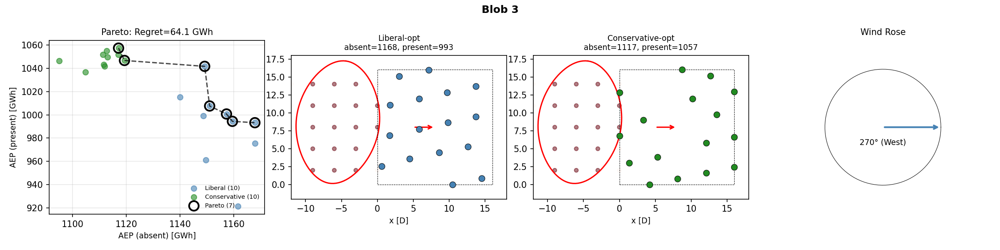

# Cluster Tradeoffs

Discovering worst-case wind farm cluster configurations that maximize design regret.

**[📖 Documentation](https://kilojoules.github.io/cluster-tradeoffs/)** | [Methodology](https://kilojoules.github.io/cluster-tradeoffs/methodology/) | [Results](https://kilojoules.github.io/cluster-tradeoffs/results/) | [Replication Guide](https://kilojoules.github.io/cluster-tradeoffs/replication/)

## Research Question

What is the maximum regret we can create for a wind farm by controlling neighboring wind farm characteristics?

## Key Finding

For certain neighbor configurations (blob geometries), choosing a "liberal" design strategy (ignoring neighbors) can cost up to **64 GWh/year** compared to a "conservative" design that accounts for potential neighbors.

## Results

### Blob 3: Highest Regret Configuration (64.1 GWh)



**Panels (left to right):**
1. **Pareto frontier**: AEP with neighbors absent vs present. Hollow circles mark Pareto-optimal layouts.
2. **Liberal-optimal layout**: Maximizes AEP when alone (1168 GWh), but drops to 993 GWh when neighbors appear.
3. **Conservative-optimal layout**: Shifted downwind to avoid neighbor wakes. Achieves 1117 GWh alone, 1057 GWh with neighbors.
4. **Wind rose**: Single direction from west (270°).

**Regret = 1057 - 993 = 64 GWh** — the cost of choosing liberal when neighbors appear.

### Summary Across All Blob Configurations

| Blob | Regret (GWh) | Pareto Points |
|------|-------------|---------------|
| 3    | **64.1**    | 7             |
| 7    | 47.3        | 4             |
| 9    | 42.0        | 4             |
| 0    | 38.9        | 3             |
| 5    | 30.7        | 3             |
| 1    | 22.1        | 3             |
| 2    | 12.6        | 2             |
| 8    | 10.0        | 3             |
| 4    | 8.3         | 2             |
| 6    | **2.3**     | 2             |

## Methodology

### Inner Optimization (per blob configuration)

1. Run 10 multi-start SGD optimizations assuming **no neighbors** (liberal strategy)
2. Run 10 multi-start SGD optimizations assuming **neighbors present** (conservative strategy)
3. Pool all 20 layouts
4. Evaluate each layout under both scenarios (neighbors absent / present)
5. Compute Pareto frontier and regret

### Regret Definition

- **Pareto frontier**: Layouts where no other layout dominates in both AEP_absent and AEP_present
- **Liberal-optimal**: Pareto point with max AEP_absent
- **Conservative-optimal**: Pareto point with max AEP_present
- **Regret** = AEP_present(conservative-opt) - AEP_present(liberal-opt)

If regret > 0, there is a fundamental tradeoff between optimizing for isolated vs. neighbor scenarios.

## Replicating Results

### Prerequisites

```bash
# Clone the repository
git clone git@github.com:kilojoules/cluster-tradeoffs.git
cd cluster-tradeoffs

# Install dependencies with pixi
pixi install
```

### Run the Analysis

```bash
# Full analysis (10 blobs × 20 optimizations = 200 total)
pixi run python scripts/run_regret_discovery.py
```

This will:
1. Generate 10 random blob configurations
2. For each blob, run pooled multi-start optimization
3. Save results to `blob_discovery/results.json`
4. Generate plots: `blob_discovery/blob_*.png` and `blob_discovery/pareto_frontier.png`

### Configuration

Edit `scripts/run_regret_discovery.py` to modify:

```python
run_multistart_pooled_discovery(
    n_blobs=10,              # Number of blob configurations to test
    n_starts_per_strategy=10  # Random starts per strategy (liberal/conservative)
)
```

SGD settings (line ~170):
```python
SGDSettings(
    max_iter=3000,           # SGD iterations per optimization
    learning_rate=D / 5      # Learning rate (D = rotor diameter)
)
```

## Wind Rose Effects on Regret

### Research Question

How does wind directionality affect design regret? Does the single-direction assumption (270°) represent a worst case, or do realistic multi-directional wind roses produce similar tradeoffs?

### Wind Rose Types Tested

| Type | Description | Parameters |
|------|-------------|------------|
| **Single** | Unidirectional (baseline) | 270° only |
| **Uniform** | Omnidirectional | 24 directions, equal probability |
| **Von Mises κ=1** | Mild concentration | Centered at 270°, diffuse |
| **Von Mises κ=2** | Moderate concentration | Typical offshore |
| **Von Mises κ=4** | High concentration | Approaching unidirectional |
| **Bimodal** | Two dominant directions | 270° (70%) + 90° (30%) |

The Von Mises distribution is the circular analog of the normal distribution, with concentration parameter κ controlling spread (κ=0 is uniform, κ→∞ is single direction).

### Key Findings


**Converged regret values** (20 blobs, 20 starts per strategy = 4,800 optimizations):

| Wind Rose | Max Regret (GWh) | Mean Regret (GWh) | Interpretation |
|-----------|------------------|-------------------|----------------|
| Single (270°) | **60.99** | 20.2 | Worst case — persistent wake alignment |
| Von Mises κ=1 | 35.74 | 10.3 | Diffuse, approaching uniform |
| Von Mises κ=4 | 31.76 | 13.4 | High concentration |
| Uniform | 25.74 | 11.9 | Neighbors affect from all directions |
| Bimodal | 19.66 | 7.4 | Two danger zones |
| Von Mises κ=2 | **16.13** | 4.4 | **Sweet spot** — minimal regret |

**Non-monotonic relationship**: Regret doesn't simply decrease with more directional spread. There's a minimum around moderate concentration (κ≈2):

```
Single → κ=1 → κ=4 → Uniform → Bimodal → κ=2
  61      36     32      26       20       16   (max regret, GWh)
```

**Physical interpretation**:
- **Too concentrated** (single direction): Wake corridor is narrow but intense
- **Too diffuse** (uniform): Neighbors affect you from everywhere — no "safe" layout exists
- **Moderate** (κ≈2): Directional preference allows layout adaptation without extreme penalties

### Convergence Verification


Regret values stabilize by n=20 starts per strategy:

| Configuration | n=5 | n=10 | n=20 | n=40 | Reduction |
|--------------|-----|------|------|------|-----------|
| Single direction | 53.70 | 38.62 | 41.15 | 38.62 | -28% |
| Uniform | 24.27 | 24.27 | 20.29 | 20.29 | -16% |
| Von Mises κ=4 | 16.69 | 17.75 | 9.77 | 9.77 | -41% |

The full analysis uses 20 blobs × 20 starts per strategy = 800 optimizations per wind rose type (4,800 total).

### Replicating Wind Rose Analysis

```bash
# Run comparison across all wind rose types (5 blobs × 5 starts × 6 types)
pixi run python scripts/run_regret_discovery.py --wind-rose=comparison --n-blobs=5 --n-starts=5

# Run with specific wind rose configuration
pixi run python scripts/run_regret_discovery.py --wind-rose=von_mises --concentration=2.0 --n-blobs=10

# Run convergence study
pixi run python scripts/run_convergence_study.py
```

**Command-line options:**

```
--wind-rose, -w     Wind rose type: single, uniform, von_mises, bimodal, comparison
--n-directions, -d  Number of wind directions (default: 24)
--dominant-dir      Dominant direction in degrees (default: 270)
--concentration, -k Von Mises kappa parameter (default: 2.0)
--secondary-dir     Secondary direction for bimodal (default: 90)
--n-blobs           Number of blob configurations (default: 10)
--n-starts          Optimization starts per strategy (default: 10)
--output-dir, -o    Output directory (auto-generated if not specified)
```

## Dependencies

Currently includes `pixwake` source in `src/`. Future work will disentangle this into a proper dependency.

Key modules used:
- `pixwake.optim.adversarial.PooledBlobDiscovery` — pooled multi-start optimization
- `pixwake.optim.sgd.topfarm_sgd_solve` — constrained SGD optimizer
- `pixwake.optim.geometry.BSplineBoundary` — blob geometry representation
