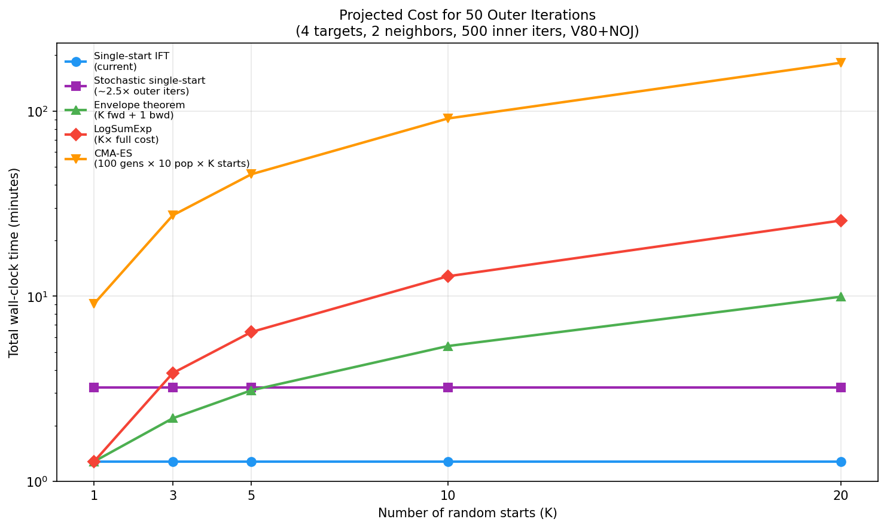

# Computational Cost Tradeoffs in IFT Bilevel Optimization

This document reports measured wall-clock costs for the IFT (Implicit Function Theorem) bilevel optimization pipeline, identifies the true bottleneck, and projects costs for multistart strategies. Theory for each multistart approach is included.

All measurements use a 4-turbine V80 + NOJ deficit setup with 2 neighbors and a single wind direction (270deg, 9 m/s). See `scripts/explore_cost_tradeoffs.py` to reproduce.

## 1. Background: The Bilevel Problem

The bilevel optimization has two nested levels:

```
OUTER: max_{neighbors}  regret(neighbors)
         where regret = AEP_liberal - AEP_conservative(neighbors)

INNER: AEP_conservative(neighbors) = AEP(x*(neighbors), neighbors)
         where x* = argmin_x  -AEP(x, neighbors)   s.t. boundary, spacing
```

One call to `value_and_grad(compute_regret)(neighbor_params)` requires:

- **Forward pass:** Run `topfarm_sgd_solve` (constrained SGD via `jax.lax.while_loop`), then evaluate AEP at the optimum.
- **Backward pass (IFT):** At the converged optimum `(x*, y*)`, compute the implicit gradient without re-running the inner loop:
  1. Cross-derivative Jacobian `d^2L/d(x,y)d(params)` via central finite differences (2 x n_params grad evaluations)
  2. Conjugate Gradient solver for the adjoint equation `(H + lambda*I) v = g` (up to 100 CG iterations, each doing 1 HVP via 2 grad evaluations)
  3. Matrix-vector product `v^T @ Jacobian` (no additional sim calls)

## 2. Key Finding: XLA Compilation via while_loop

The inner SGD solver uses `jax.lax.while_loop`, which JAX compiles into a single fused XLA program. This means the entire multi-thousand-step optimization loop runs as compiled machine code, not as Python-level iteration.

| Metric | Value |
|--------|-------|
| Single wake sim forward | 60 ms |
| Single grad evaluation (Python-level) | 195 ms |
| Naive estimate for 500-step SGD (500 x 2 x 195ms) | 195 s |
| **Actual measured 500-step SGD** | **0.44 s** |
| **XLA speedup** | **~357x** |

The practical implication: `topfarm_sgd_solve` is already effectively JIT-compiled through `while_loop`. There is no need to wrap it in an explicit `@jax.jit` decorator for the forward pass. The XLA compiler fuses the loop body, eliminating Python dispatch overhead for each iteration.

## 3. Measured Cost Breakdown

For a single outer gradient step (4 targets, 2 neighbors, 500 max inner iters):

| Component | Wall-clock | Share |
|-----------|-----------|-------|
| Forward pass (SGD + AEP eval) | 0.55 s | 36% |
| Backward pass (Jacobian FD + CG) | 0.99 s | 64% |
| **Total** | **1.54 s** | 100% |


**The backward pass dominates.** This is the opposite of what the naive operation-count model predicts. The forward SGD is cheap because `while_loop` fuses it into XLA. The backward pass is more expensive because:
- The Jacobian FD loop (`vmap` over `compute_jac_col`) evaluates `jax.grad(total_obj)` at 2 x n_params perturbed parameter vectors
- The CG solver runs its own `while_loop` with HVP evaluations at each iteration
- Each individual grad/HVP call goes through the wake sim's `fixed_point` custom_vjp

## 4. Inner Iteration Sweep

Varying `max_iter` from 50 to 3000 has negligible effect on both regret accuracy and gradient quality for this problem:

| max_iter | Regret (GWh) | Gradient cosine sim | Wall-clock |
|----------|-------------|-------------------|------------|
| 50 | 7.8480 | 1.0000 | 1.58 s |
| 100 | 7.8480 | 1.0000 | 1.67 s |
| 300 | 7.8480 | 1.0000 | 1.38 s |
| 500 | 7.8480 | 1.0000 | 1.47 s |
| 3000 | 7.8480 | 1.0000 | 1.57 s |


The inner SGD converges well before 50 iterations for this 4-turbine problem (the `while_loop` exits early via the tolerance check). Cost is flat because the backward pass dominates and is independent of `max_iter`.

**Implication:** For larger problems where convergence is slower, reducing `max_iter` could save forward-pass time without degrading gradient quality, as long as the inner solver reaches an approximate optimum.

## 5. Neighbor Count Scaling

How does cost scale with the number of neighbor parameters?

| Neighbors | Params | Forward | Backward | Total |
|-----------|--------|---------|----------|-------|
| 1 | 2 | 0.43 s | 0.92 s | 1.35 s |
| 2 | 4 | 0.41 s | 0.93 s | 1.35 s |
| 4 | 8 | 0.52 s | 0.92 s | 1.44 s |
| 6 | 12 | 0.47 s | 1.07 s | 1.54 s |


- **Forward cost** is nearly constant: neighbors are just additional inputs to the wake sim, and the SGD loop complexity is unchanged.
- **Backward cost** grows slowly: the Jacobian FD requires 2 x n_params grad evaluations, but `vmap` parallelizes them. Going from 2 to 12 parameters increases backward cost by only ~16%.

## 6. Efficiency Frontier

The "efficiency frontier" plots gradient quality (cosine similarity to a high-iteration reference) against wall-clock cost:


For this problem, all points sit at cosine similarity = 1.0, so the sweet spot is simply the fastest option (300 inner iterations at 1.38 s). For larger problems where convergence is slower, this plot would reveal the point of diminishing returns.

## 7. Theory: Multistart Strategies

### The Problem

IFT assumes a unique, smooth mapping `params -> x*(params)`. With K random starts, the inner optimization finds K different local optima, and the true regret uses the best:

```
true_regret(p) = AEP_liberal - max_k AEP(x*_k(p), p)
```

The `max` operator is non-differentiable at points where the identity of the winning start changes.

### Strategy 1: Stochastic Single-Start

**Idea:** Randomize `init_x, init_y` each outer iteration. The gradient is a stochastic estimate:

```
grad_t = grad regret(p; start_t)    where start_t ~ Uniform
```

**Theory:** By the law of total expectation, if the inner landscape has M local optima with basins of attraction B_1, ..., B_M, then:

```
E[grad_t] = sum_m P(start in B_m) * grad regret_m(p)
```

This is a probability-weighted average of gradients through each local optimum. ADAM momentum averages over iterations, smoothing the variance. The gradient is **unbiased** in expectation but has high variance when different starts lead to very different gradients.

**Cost:** Same as single-start (1x). May need 2-3x more outer iterations for convergence due to variance.

### Strategy 2: Soft Selection via LogSumExp

**Idea:** Run K starts, compute regret for each, aggregate with a smooth approximation to max:

```
soft_max_regret(p) = (1/tau) * log( sum_k exp(tau * regret_k(p)) )
```

**Theory:** The LogSumExp function is the Moreau envelope of the max function. As temperature `tau -> infinity`, it converges to the true max. For finite tau, it provides a differentiable approximation with bounded error:

```
max_k regret_k <= soft_max <= max_k regret_k + log(K) / tau
```

The gradient flows through all K starts, weighted by their softmax probabilities:

```
grad soft_max = sum_k w_k * grad regret_k
where w_k = exp(tau * regret_k) / sum_j exp(tau * regret_j)
```

As `tau` increases, weight concentrates on the winning start. The gradient is always well-defined and smooth.

**Cost:** K x (forward + backward) per outer iteration. For K=5, this is 5x the single-start cost.

### Strategy 3: Envelope Theorem

**Idea:** The envelope theorem from mathematical economics states that for a parametric optimization problem:

```
V(p) = max_x f(x, p)    s.t. g(x, p) <= 0
```

the total derivative of the value function is:

```
dV/dp = partial f / partial p |_{x=x*(p)}
```

That is, the derivative of the optimum value with respect to parameters equals the partial derivative evaluated at the optimal point, **ignoring how x* changes with p**. This holds whenever the optimal solution x*(p) is locally unique and continuously differentiable in p (i.e., away from bifurcation points where the winning start switches).

**Applied to multistarts:** When the winning start k* is locally stable:

```
d/dp max_k regret_k(p) = d/dp regret_{k*}(p)
```

So we only need the IFT backward pass through the winning start:

```python
# Forward: run K starts (no grad, can use jax.lax.stop_gradient)
regrets = [compute_regret_no_grad(p, start_k) for k in range(K)]
best_k = argmax(regrets)
# Backward: IFT through winner only
regret, grad = value_and_grad(compute_regret_start[best_k])(p)
```

**Cost:** K x forward + 1 x backward. Since backward (0.99s) > forward (0.55s) for our problem, this is significantly cheaper than LogSumExp:

| K starts | Envelope theorem | LogSumExp |
|----------|-----------------|-----------|
| 1 | 1.54 s | 1.54 s |
| 5 | 3.74 s | 7.70 s |
| 10 | 6.49 s | 15.40 s |
| 20 | 11.99 s | 30.80 s |

**Caveat:** The gradient is incorrect at "switching boundaries" where the identity of the best start changes. In practice, ADAM momentum smooths over these discontinuities. For safety, one can detect switches (when `best_k` changes between consecutive outer iterations) and take a smaller step or skip the gradient update.

### Strategy 4: Hybrid Evaluation + IFT Search

**Idea:** Use IFT gradients for search direction, but periodically validate with full multi-start evaluation (no gradients). This separates the search problem (find promising neighbor positions) from the evaluation problem (accurately estimate regret at a given position).

**Cost:** IFT cost for search + K-start forward cost for periodic validation. If validation runs every M outer iterations, amortized cost per step is:

```
cost_per_step = cost_IFT + (K * cost_fwd) / M
```

### Strategy 5: CMA-ES (Derivative-Free Baseline)

**Theory:** CMA-ES (Covariance Matrix Adaptation Evolution Strategy) maintains a multivariate Gaussian distribution over neighbor positions and updates it based on population fitness rankings. No gradients needed --- only forward evaluations.

**Cost:** `n_generations x population_size x K_starts x cost_fwd`. For typical settings (100 generations, population 10, K=5 starts):

```
100 x 10 x 5 x 0.55s = 2750s = 45.8 min
```

This is 12x more expensive than envelope theorem IFT (3.1 min for 50 outer iterations with K=5).

## 8. Projected Costs for 50 Outer Iterations



| Strategy | K=1 | K=5 | K=10 | K=20 |
|----------|-----|-----|------|------|
| Single-start IFT | 1.3 min | 1.3 min | 1.3 min | 1.3 min |
| Stochastic single-start (~2.5x iters) | 3.2 min | 3.2 min | 3.2 min | 3.2 min |
| Envelope theorem (K fwd + 1 bwd) | 1.3 min | 3.1 min | 5.4 min | 9.9 min |
| LogSumExp (K x full cost) | 1.3 min | 6.4 min | 12.8 min | 25.6 min |
| CMA-ES (100 gens x 10 pop x K starts) | 9.1 min | 45.5 min | 91.1 min | 182.1 min |

**Recommendation:** The envelope theorem (Strategy 3) offers the best cost/robustness tradeoff. At K=5, it costs 3.1 min for 50 outer iterations --- only 2.4x more than single-start --- while providing multistart robustness for the forward evaluation.

## 9. Scaling to Production

These benchmarks use a small problem (4 turbines, NOJ deficit, 1 wind direction). For the production setup (16 turbines, BastankhahGaussian deficit, multiple wind directions):

- **Wake sim cost** scales with n_turbines^2 (pairwise deficit computation) and linearly with n_wind_directions
- **Inner SGD iterations** will increase (larger search space, slower convergence)
- **Backward pass cost** scales linearly with n_params (Jacobian FD) but the CG solver may need more iterations for larger Hessians
- **XLA compilation** remains effective: `while_loop` compiles regardless of problem size, though each compiled iteration is more expensive

**Expected production cost:** Roughly 10-50x the V80+NOJ benchmarks, putting a single outer gradient step at ~15-75s and a 50-iteration run at ~12-62 min for single-start IFT.

## Reproducing These Results

```bash
pixi run python scripts/explore_cost_tradeoffs.py
```

Outputs are saved to `analysis/cost_tradeoffs/` (gitignored) and `docs/cost_tradeoffs/` (committed).
