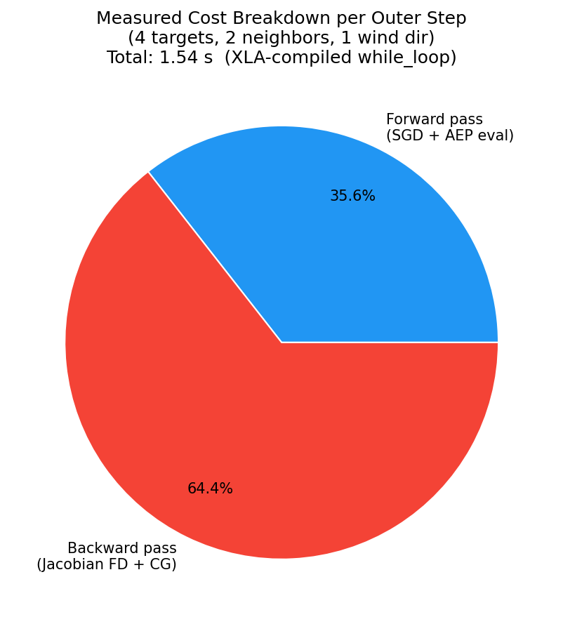
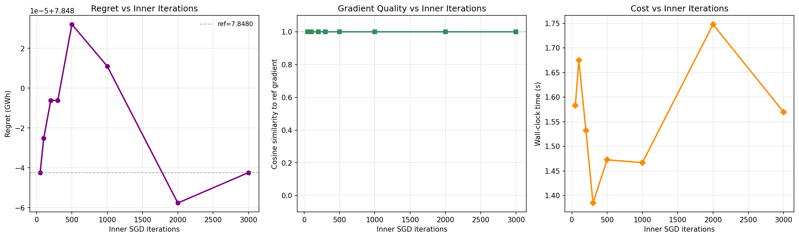
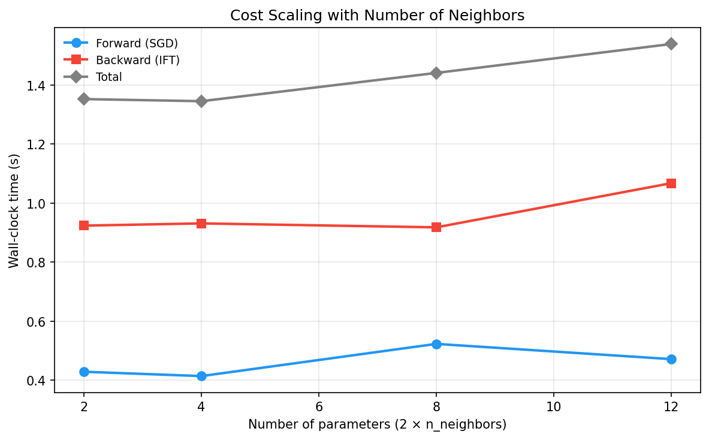
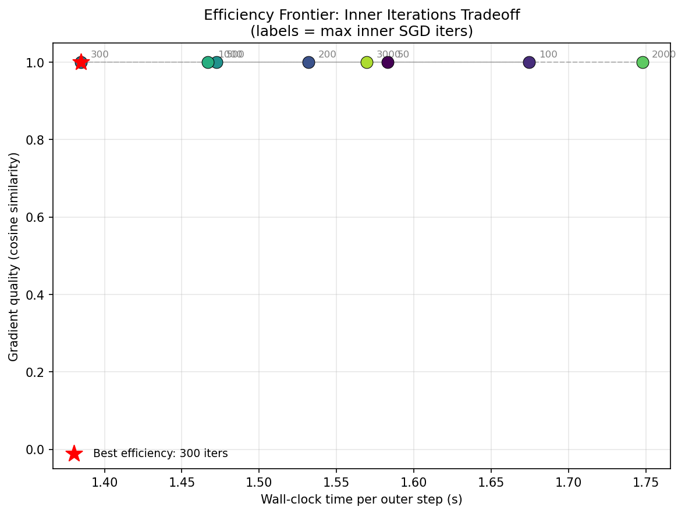

# Cost Analysis

Measured wall-clock costs for the IFT bilevel optimization pipeline, identifying the true bottleneck and key scaling behaviors.

All measurements use a 4-turbine V80 + NOJ deficit setup with 2 neighbors and a single wind direction (270deg, 9 m/s). Reproduce with:

```bash
pixi run python scripts/explore_cost_tradeoffs.py
```

## The Bilevel Problem

The bilevel optimization has two nested levels:

```
OUTER: max_{neighbors}  regret(neighbors)
         where regret = AEP_liberal - AEP_conservative(neighbors)

INNER: AEP_conservative(neighbors) = AEP(x*(neighbors), neighbors)
         where x* = argmin_x  -AEP(x, neighbors)   s.t. boundary, spacing
```

One call to `value_and_grad(compute_regret)(neighbor_params)` requires:

- **Forward pass:** Run `topfarm_sgd_solve` (constrained SGD via `jax.lax.while_loop`), then evaluate AEP at the optimum.
- **Backward pass (IFT):** At the converged optimum `(x*, y*)`, compute the implicit gradient without re-running the inner loop:
  1. Cross-derivative Jacobian `d^2L/d(x,y)d(params)` via central finite differences (2 x n_params grad evaluations)
  2. Conjugate Gradient solver for the adjoint equation `(H + lambda*I) v = g` (up to 100 CG iterations, each doing 1 HVP via 2 grad evaluations)
  3. Matrix-vector product `v^T @ Jacobian` (no additional sim calls)

## XLA Compilation via while_loop

The inner SGD solver uses `jax.lax.while_loop`, which JAX compiles into a single fused XLA program. The entire multi-thousand-step optimization loop runs as compiled machine code, not as Python-level iteration.

| Metric | Value |
|--------|-------|
| Single wake sim forward | 60 ms |
| Single grad evaluation (Python-level) | 195 ms |
| Naive estimate for 500-step SGD (500 x 2 x 195ms) | 195 s |
| **Actual measured 500-step SGD** | **0.44 s** |
| **XLA speedup** | **~357x** |

`topfarm_sgd_solve` is already effectively JIT-compiled through `while_loop`. There is no need for an explicit `@jax.jit` decorator. The XLA compiler fuses the loop body, eliminating Python dispatch overhead for each iteration.

## Measured Cost Breakdown

For a single outer gradient step (4 targets, 2 neighbors, 500 max inner iters):

| Component | Wall-clock | Share |
|-----------|-----------|-------|
| Forward pass (SGD + AEP eval) | 0.55 s | 36% |
| Backward pass (Jacobian FD + CG) | 0.99 s | 64% |
| **Total** | **1.54 s** | 100% |



**The backward pass dominates.** This is the opposite of what the naive operation-count model predicts. The forward SGD is cheap because `while_loop` fuses it into XLA. The backward pass is more expensive because:

- The Jacobian FD loop (`vmap` over `compute_jac_col`) evaluates `jax.grad(total_obj)` at 2 x n_params perturbed parameter vectors
- The CG solver runs its own `while_loop` with HVP evaluations at each iteration
- Each individual grad/HVP call goes through the wake sim's `fixed_point` custom_vjp

## Inner Iteration Sweep

Varying `max_iter` from 50 to 3000 has negligible effect on both regret accuracy and gradient quality for this problem:

| max_iter | Regret (GWh) | Gradient cosine sim | Wall-clock |
|----------|-------------|-------------------|------------|
| 50 | 7.8480 | 1.0000 | 1.58 s |
| 100 | 7.8480 | 1.0000 | 1.67 s |
| 300 | 7.8480 | 1.0000 | 1.38 s |
| 500 | 7.8480 | 1.0000 | 1.47 s |
| 3000 | 7.8480 | 1.0000 | 1.57 s |



The inner SGD converges well before 50 iterations for this 4-turbine problem (the `while_loop` exits early via the tolerance check). Cost is flat because the backward pass dominates and is independent of `max_iter`.

**Implication:** For larger problems where convergence is slower, reducing `max_iter` could save forward-pass time without degrading gradient quality, as long as the inner solver reaches an approximate optimum.

## Neighbor Count Scaling

How does cost scale with the number of neighbor parameters?

| Neighbors | Params | Forward | Backward | Total |
|-----------|--------|---------|----------|-------|
| 1 | 2 | 0.43 s | 0.92 s | 1.35 s |
| 2 | 4 | 0.41 s | 0.93 s | 1.35 s |
| 4 | 8 | 0.52 s | 0.92 s | 1.44 s |
| 6 | 12 | 0.47 s | 1.07 s | 1.54 s |



- **Forward cost** is nearly constant: neighbors are just additional inputs to the wake sim, and the SGD loop complexity is unchanged.
- **Backward cost** grows slowly: the Jacobian FD requires 2 x n_params grad evaluations, but `vmap` parallelizes them. Going from 2 to 12 parameters increases backward cost by only ~16%.

## Efficiency Frontier

The "efficiency frontier" plots gradient quality (cosine similarity to a high-iteration reference) against wall-clock cost:



For this problem, all points sit at cosine similarity = 1.0, so the sweet spot is simply the fastest option (300 inner iterations at 1.38 s). For larger problems where convergence is slower, this plot would reveal the point of diminishing returns.

## Scaling to Production

These benchmarks use a small problem (4 turbines, NOJ deficit, 1 wind direction). For the production setup (16 turbines, BastankhahGaussian deficit, multiple wind directions):

- **Wake sim cost** scales with n_turbines^2 (pairwise deficit computation) and linearly with n_wind_directions
- **Inner SGD iterations** will increase (larger search space, slower convergence)
- **Backward pass cost** scales linearly with n_params (Jacobian FD) but the CG solver may need more iterations for larger Hessians
- **XLA compilation** remains effective: `while_loop` compiles regardless of problem size, though each compiled iteration is more expensive

**Expected production cost:** Roughly 10-50x the V80+NOJ benchmarks, putting a single outer gradient step at ~15-75s and a 50-iteration run at ~12-62 min for single-start IFT.
