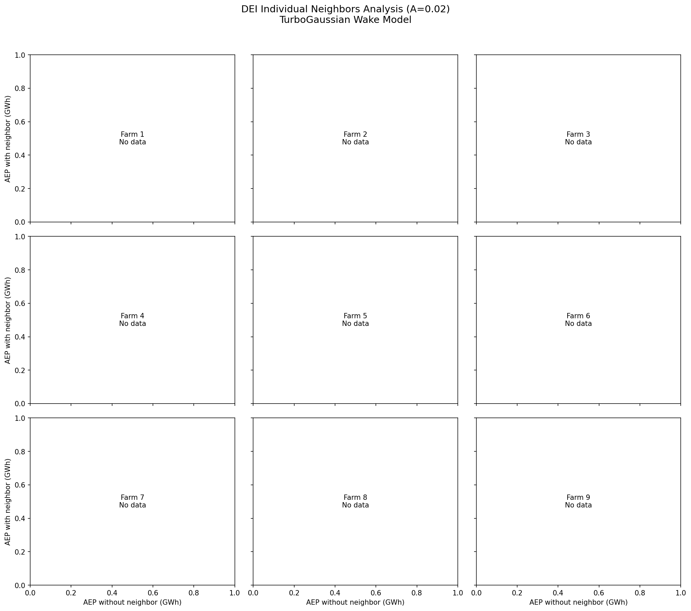
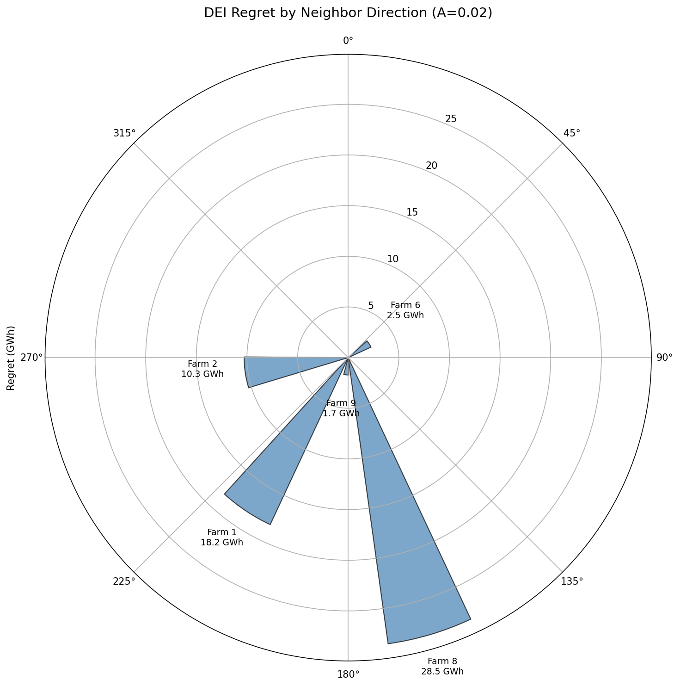
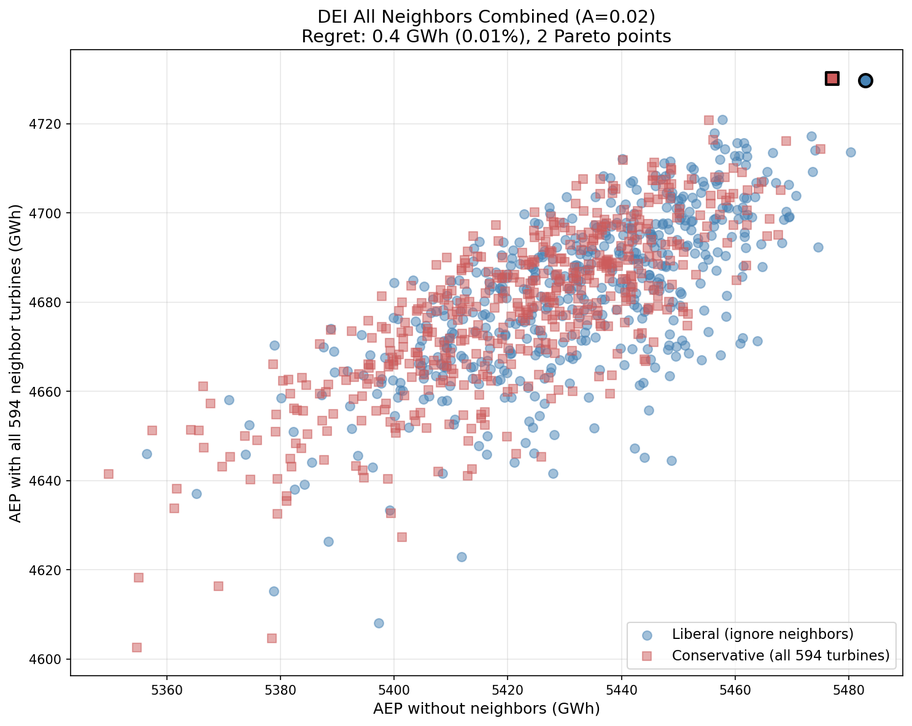

# DEI Analysis: A = 0.02 (Narrow Wakes)

This page documents the Danish Energy Island regret analysis using the TurboGaussian wake model with A=0.02.

**See also:** [A=0.10 Analysis](dei-A0.10.md) | [DEI Case Study](dei-case-study.md) | [Methodology](dei-methodology.md)

## Configuration

| Parameter | Value |
|-----------|-------|
| Wake Model | TurboGaussianDeficit |
| **A (expansion)** | **0.02** |
| ct2a | ct2a_mom1d |
| ctlim | 0.96 |
| Superposition | SquaredSum |
| Ambient TI | 0.06 |
| Optimization | 50 starts × 2000 iterations |

A=0.02 produces **narrow wake cones**, meaning wake effects persist further downstream but affect a smaller lateral area.

## Summary Results

| Case | Regret (GWh) | Regret (%) | Pareto Points |
|------|--------------|------------|---------------|
| Farm 1 (SW, 214°) | 18.19 | 0.34% | 2 |
| Farm 2 (W, 262°) | 10.28 | 0.20% | 2 |
| Farm 3 (NW, 335°) | 0.00 | 0.00% | 1 |
| Farm 4 (N, 349°) | 0.00 | 0.00% | 1 |
| Farm 5 (NE, 19°) | 0.00 | 0.00% | 1 |
| Farm 6 (E, 57°) | 2.48 | 0.05% | 2 |
| Farm 7 (SE, 89°) | 0.00 | 0.00% | 1 |
| **Farm 8 (S, 163°)** | **28.51** | **0.54%** | 3 |
| Farm 9 (SSW, 186°) | 1.71 | 0.03% | 2 |
| **All 9 combined** | **11.52** | **0.24%** | 5 |

**Key finding:** Farm 8 (South) causes the largest individual regret at 28.51 GWh. With narrow wakes (A=0.02), multiple farms show non-zero regret.

## Individual Neighbors Analysis


*Pareto frontiers for each of the 9 neighbors. Blue circles = liberal strategy (ignore neighbor), red squares = conservative strategy (consider neighbor). Black outlines indicate Pareto-optimal layouts.*

### Observations

- **Farm 8 (S, 163°)**: Highest regret at 28.51 GWh (0.54% of AEP)
- **Farm 1 (SW, 214°)**: Second highest at 18.19 GWh (0.34%)
- **Farm 2 (W, 262°)**: 10.28 GWh from the dominant wind direction
- **Farms 3, 4, 5, 7**: Zero regret - layout optimization is unaffected by these neighbors

## Regret by Direction


*Design regret varies strongly with neighbor direction. Southern neighbors (Farm 8) cause the most regret.*

The polar plot shows that regret is concentrated in the southern sector (163-214°), not the dominant western wind direction. This is the "ambush effect" - the liberal layout is already optimized for westerly wakes.

## All Neighbors Combined


*Pareto frontier when all 594 neighbor turbines are present. The combined regret (11.52 GWh) is lower than Farm 8 alone, suggesting the ring geometry partially mitigates individual neighbor effects.*

| Layout | AEP Alone | AEP with All 594 | Wake Loss |
|--------|-----------|------------------|-----------|
| Liberal-optimal | 5469 GWh | 4698 GWh | -14.1% |
| Conservative-optimal | 5453 GWh | 4710 GWh | -13.6% |
| **Regret** | | **11.52 GWh** | |

The combined case shows 5 Pareto-optimal layouts spanning 11.52 GWh of regret.

## Comparison with A=0.10

| Metric | A=0.02 | A=0.10 |
|--------|--------|--------|
| Wake cone | Narrow | Wide |
| Farm 8 regret | 28.51 GWh | ~24 GWh |
| Combined regret | 11.52 GWh | 9.70 GWh |
| Farms with regret | 5 of 9 | 5 of 9 |

Narrower wakes (A=0.02) produce higher regret because wake effects are more concentrated and harder to avoid through layout optimization.

## PyWake Verification

To confirm these results are not artifacts of the pixwake implementation, we evaluated the pixwake-optimized layouts using PyWake with identical wake model configuration (TurboGaussianDeficit, A=0.02, SquaredSum superposition, no turbulence model).

### Farm 8 Verification

Evaluating all 100 pixwake layouts in PyWake:

| Metric | PyWake | pixwake | Difference |
|--------|--------|---------|------------|
| Liberal-opt AEP (alone) | 5455.7 GWh | 5469.0 GWh | -0.24% |
| Liberal-opt AEP (w/neighbor) | 5276.9 GWh | 5294.2 GWh | -0.33% |
| Conservative-opt AEP (alone) | 5439.0 GWh | 5453.1 GWh | -0.26% |
| Conservative-opt AEP (w/neighbor) | 5306.3 GWh | 5322.7 GWh | -0.31% |
| **Regret** | **29.49 GWh** | **28.51 GWh** | +1.0 GWh |

### Combined Case Verification

Evaluating the 5 pixwake Pareto-optimal layouts in PyWake:

| Metric | PyWake | pixwake | Difference |
|--------|--------|---------|------------|
| **Regret** | **9.07 GWh** | **11.52 GWh** | -2.5 GWh |

**Conclusion:** PyWake confirms the design regret found by pixwake. AEP values match within ~0.3%, and both implementations find ~10-30 GWh of regret depending on the case. The tradeoffs are real and not artifacts of the pixwake implementation.

### Verification Script

```bash
pixi run python scripts/verify_A0.02_pywake.py --farm=8
pixi run python scripts/verify_A0.02_pywake.py --combined
```

## Data Files

Results are stored in `analysis/dei_A0.02/`:

- `layouts_farm{1-9}.h5` - Optimized layouts for each neighbor case
- `layouts_combined.h5` - Optimized layouts for all-neighbors case
- `dei_single_neighbor_turbopark_farm{1-9}.json` - Individual farm results
- `dei_single_neighbor_turbopark_farm.json` - Combined case results

## Replication

```bash
# Run all farms in parallel batches
for farm in 1 2 3 4 5 6 7 8 9; do
    pixi run python scripts/run_dei_single_neighbor.py \
        --n-starts=50 --max-iter=2000 \
        --A=0.02 --farm=$farm --skip-combined \
        -o analysis/dei_A0.02
done

# Run combined case (memory intensive)
pixi run python scripts/run_dei_single_neighbor.py \
    --n-starts=50 --max-iter=2000 \
    --A=0.02 --only-combined \
    -o analysis/dei_A0.02
```
