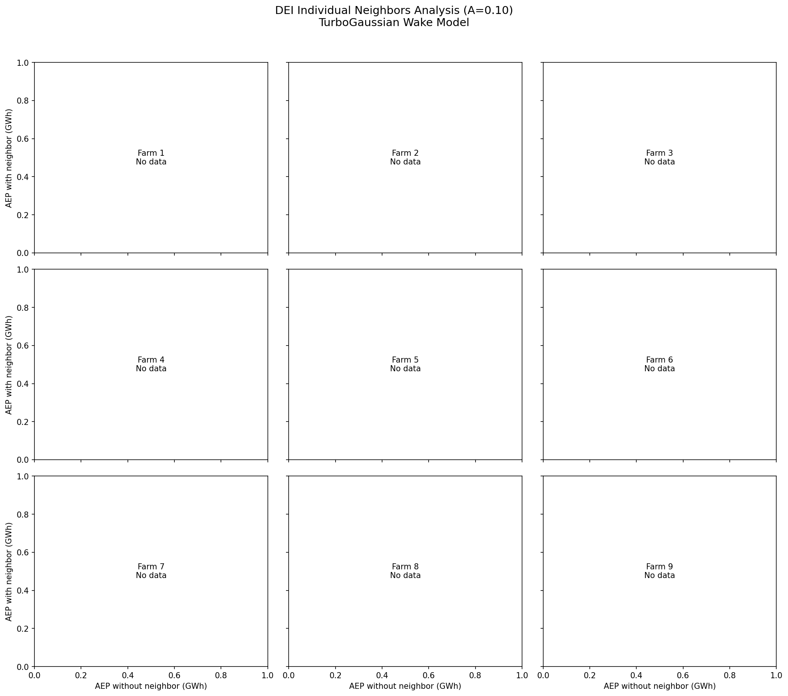
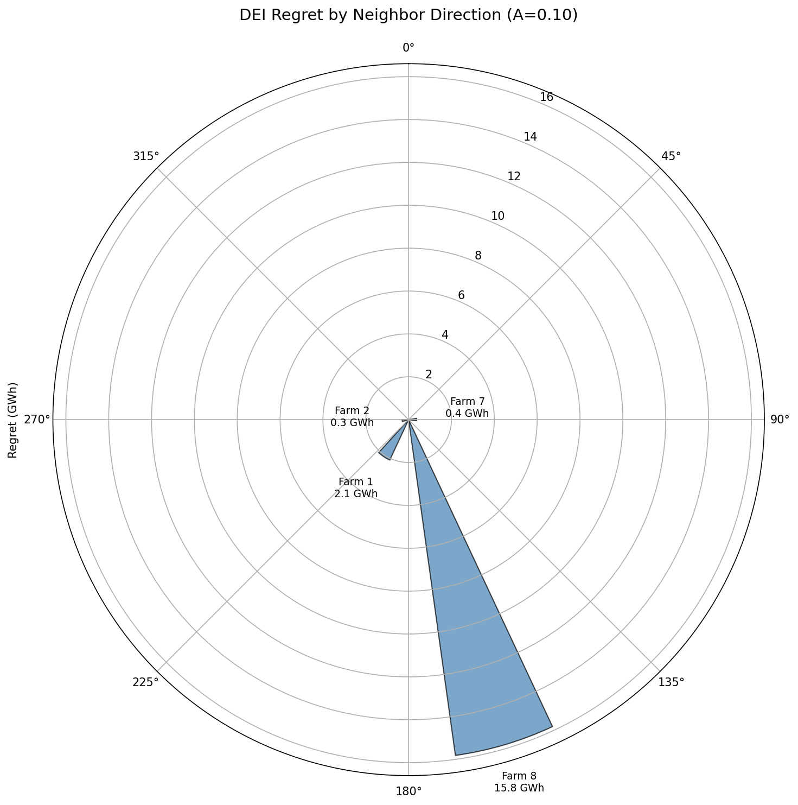
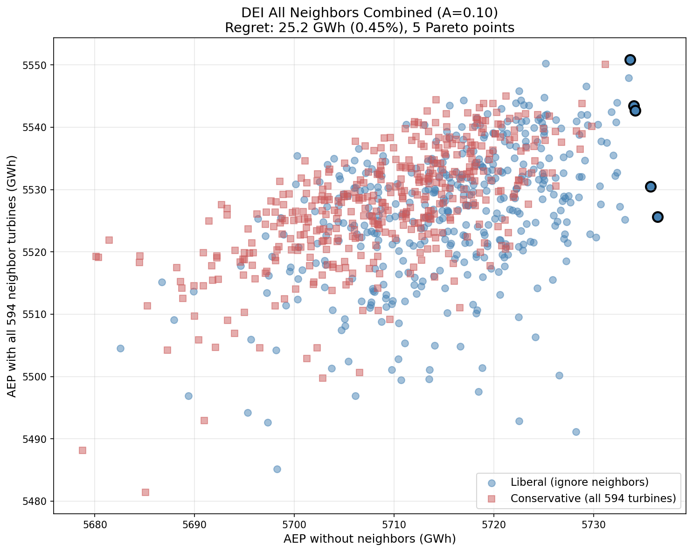

# DEI Analysis: A = 0.10 (Wider Wakes)

This page documents the Danish Energy Island regret analysis using the TurboGaussian wake model with A=0.10.

**See also:** [A=0.02 Analysis](dei-A0.02.md) | [DEI Case Study](dei-case-study.md) | [Methodology](dei-methodology.md)

## Configuration

| Parameter | Value |
|-----------|-------|
| Wake Model | TurboGaussianDeficit |
| **A (expansion)** | **0.10** |
| ct2a | ct2a_mom1d |
| ctlim | 0.96 |
| Superposition | SquaredSum |
| Ambient TI | 0.06 |
| Optimization | 50 starts × 2000 iterations |

A=0.10 produces **wider wake cones**, meaning wakes expand more rapidly and dissipate faster with downstream distance.

## Summary Results

| Case | Regret (GWh) | Regret (%) | Pareto Points |
|------|--------------|------------|---------------|
| Farm 1 (SW, 214°) | 2.08 | 0.04% | 2 |
| Farm 2 (W, 262°) | 0.30 | 0.01% | 2 |
| Farm 3 (NW, 335°) | 0.00 | 0.00% | 1 |
| Farm 4 (N, 349°) | 0.00 | 0.00% | 1 |
| Farm 5 (NE, 19°) | 0.00 | 0.00% | 1 |
| Farm 6 (E, 57°) | 0.00 | 0.00% | 1 |
| Farm 7 (SE, 89°) | 0.37 | 0.01% | 2 |
| **Farm 8 (S, 163°)** | **15.81** | **0.28%** | 3 |
| Farm 9 (SSW, 186°) | 0.00 | 0.00% | 1 |
| **All 9 combined** | **9.70** | **0.18%** | 4 |

**Key finding:** Farm 8 (South) remains the dominant source of regret at 15.81 GWh. With wider wakes (A=0.10), overall regret is reduced compared to A=0.02.

## Individual Neighbors Analysis


*Pareto frontiers for each of the 9 neighbors. Blue circles = liberal strategy (ignore neighbor), red squares = conservative strategy (consider neighbor). Black outlines indicate Pareto-optimal layouts.*

### Observations

- **Farm 8 (S, 163°)**: Dominant regret source at 15.81 GWh (0.28%)
- **Farm 1 (SW, 214°)**: Reduced to 2.08 GWh (vs 18.19 GWh at A=0.02)
- **Farms 3, 4, 5, 6, 9**: Zero regret - no design tradeoff
- **Farms 2, 7**: Negligible regret (<0.4 GWh)

Wider wakes spread the energy deficit over a larger area, making it easier for layout optimization to mitigate neighbor impacts.

## Regret by Direction


*Design regret is concentrated at Farm 8 (South, 163°). Wider wakes reduce regret from most directions.*

The southern neighbor dominates regret at both A values, but the magnitude is substantially reduced with wider wakes.

## All Neighbors Combined


*Pareto frontier when all 594 neighbor turbines are present. The combined regret (9.70 GWh) is lower than Farm 8 alone.*

| Layout | AEP Alone | AEP with All 594 | Wake Loss |
|--------|-----------|------------------|-----------|
| Liberal-optimal | 5731 GWh | 5534 GWh | -3.4% |
| Conservative-optimal | 5723 GWh | 5543 GWh | -3.1% |
| **Regret** | | **9.70 GWh** | |

The combined case shows 4 Pareto-optimal layouts spanning 9.70 GWh of regret.

## Comparison with A=0.02

| Metric | A=0.02 | A=0.10 | Change |
|--------|--------|--------|--------|
| Wake cone | Narrow | Wide | - |
| Target AEP (alone) | 5469 GWh | 5731 GWh | +4.8% |
| Farm 8 regret | 28.51 GWh | 15.81 GWh | -45% |
| Combined regret | 11.52 GWh | 9.70 GWh | -16% |
| Wake loss (combined) | 14% | 3% | -79% |

**Key differences:**
- **Higher standalone AEP**: Wider wakes = less internal wake loss = higher baseline AEP
- **Lower regret**: Wider wakes are easier to avoid through layout optimization
- **Much lower wake loss**: 3% vs 14% loss when all neighbors present

## Physical Interpretation

The A parameter controls wake expansion rate: `wake_width = A × downstream_distance`.

| A Value | Wake Character | Regret Implication |
|---------|---------------|-------------------|
| 0.02 | Narrow, persistent | Concentrated wake deficit harder to avoid |
| 0.10 | Wide, dissipating | Distributed deficit easier to mitigate |

Narrow wakes create "corridors" of reduced wind that layouts must route around. Wide wakes create a gentler reduction across a broader area that layouts can partially ignore.

## Data Files

Results are stored in `analysis/dei_A0.10/`:

- `layouts_farm{1-9}.h5` - Optimized layouts for each neighbor case
- `layouts_combined.h5` - Optimized layouts for all-neighbors case
- `dei_single_neighbor_turbopark_farm{1-9}.json` - Individual farm results
- `dei_single_neighbor_turbopark_farm.json` - Combined case results

## Replication

```bash
# Run all farms in parallel batches
for farm in 1 2 3 4 5 6 7 8 9; do
    pixi run python scripts/run_dei_single_neighbor.py \
        --n-starts=50 --max-iter=2000 \
        --A=0.10 --farm=$farm --skip-combined \
        -o analysis/dei_A0.10
done

# Run combined case (memory intensive)
pixi run python scripts/run_dei_single_neighbor.py \
    --n-starts=50 --max-iter=2000 \
    --A=0.10 --only-combined \
    -o analysis/dei_A0.10
```
