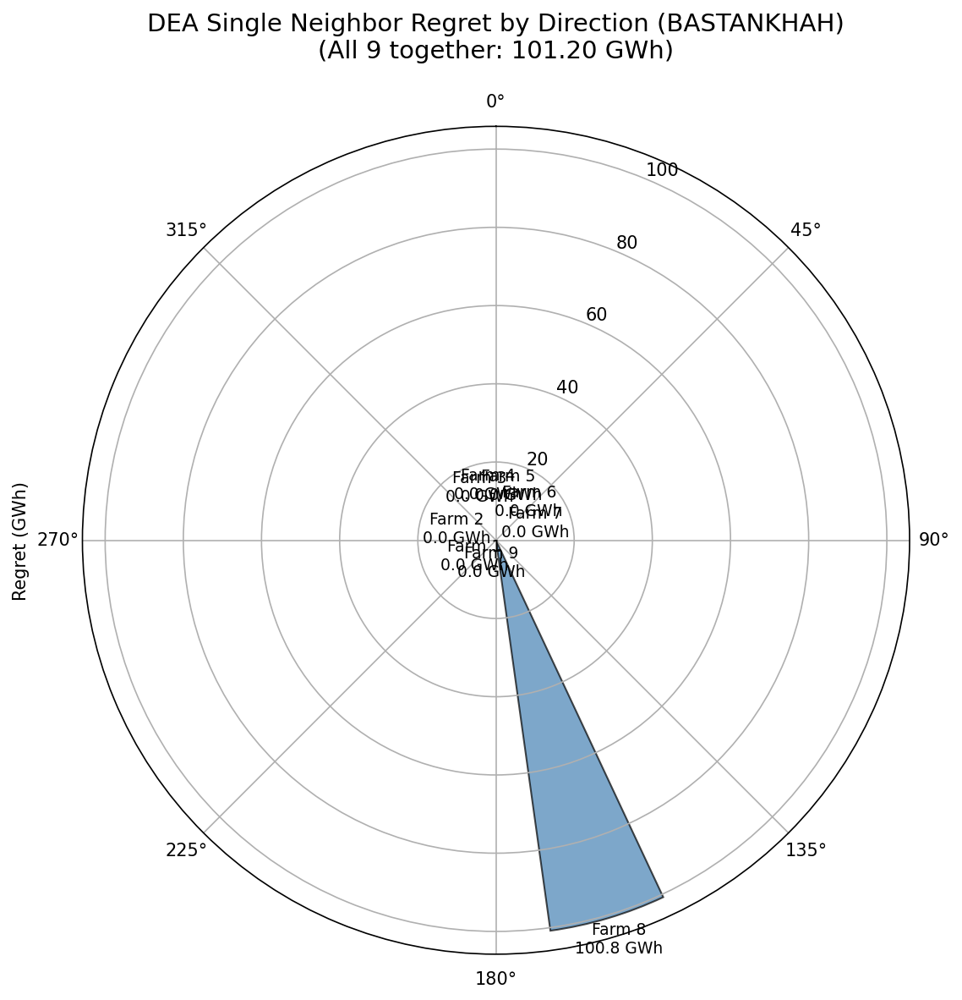

# Danish Energy Island (DEI) Case Study

This page documents our analysis of design regret in the Danish Energy Island wind farm cluster, comparing optimized layouts with randomly sampled approaches.

## Background

The Danish Energy Island is a planned offshore wind farm cluster in the North Sea featuring a central target farm (dk0w_tender_3) surrounded by 9 neighboring wind farms in a ring-like configuration. This geometry was previously analyzed in the OMAE 2026 paper, which concluded that the symmetric ring arrangement eliminates design tradeoffs.

**Our analysis challenges this conclusion** by using gradient-based layout optimization instead of random layout sampling.

## Site Configuration

### Target Farm (dk0w_tender_3)
| Parameter | Value |
|-----------|-------|
| Turbines | 66 |
| Rated power | 15 MW per turbine |
| Rotor diameter | 240 m |
| Hub height | 150 m |
| Total capacity | 990 MW |

### Neighboring Farms

| Farm | Name | Direction | Distance | Turbines |
|------|------|-----------|----------|----------|
| 1 | dk1d_tender_9 | 214° (SW) | 38.9 km | 66 |
| 2 | dk0z_tender_5 | 262° (W) | 21.9 km | 66 |
| 3 | dk0v_tender_1 | 335° (NW) | 29.2 km | 66 |
| 4 | dk0Y_tender_4 | 349° (N) | 55.2 km | 66 |
| 5 | dk0x_tender_2 | 19° (NE) | 37.2 km | 66 |
| 6 | dk1a_tender_6 | 57° (E) | 43.7 km | 66 |
| 7 | dk1b_tender7 | 89° (SE) | 24.5 km | 66 |
| 8 | dk1c_tender_8 | **163° (S)** | 29.3 km | 66 |
| 9 | dk1e_tender_10 | 186° (SSW) | 57.9 km | 66 |

**Total cluster**: 660 turbines, 9.9 GW capacity

### Wind Resource

The analysis uses 10 years of daily-averaged wind data from the Energy Island site (2012-2021):

| Parameter | Value |
|-----------|-------|
| Data points | 3,654 days |
| Mean wind speed | ~10.5 m/s at 150m |
| Dominant direction | ~270° (West) |
| Concentration (κ) | ~0.6 (diffuse) |

The wind rose is characterized by:
- **Primary peak**: 270° (West) - ~20% frequency
- **Secondary peak**: 225° (Southwest) - ~20% frequency
- **Southern winds** (160-180°): ~4% frequency
- Overall: Relatively diffuse with moderate westerly dominance

## Key Finding: Farm 8 Causes All Regret

Using gradient-based optimization with 5 multi-start runs per strategy:

| Neighbor | Direction | Distance | Regret (GWh) | Regret (%) |
|----------|-----------|----------|--------------|------------|
| Farm 1 (SW) | 214° | 38.9 km | 0.00 | 0.00% |
| Farm 2 (W) | 262° | 21.9 km | 0.00 | 0.00% |
| Farm 3 (NW) | 335° | 29.2 km | 0.00 | 0.00% |
| Farm 4 (N) | 349° | 55.2 km | 0.00 | 0.00% |
| Farm 5 (NE) | 19° | 37.2 km | 0.00 | 0.00% |
| Farm 6 (E) | 57° | 43.7 km | 0.00 | 0.00% |
| Farm 7 (SE) | 89° | 24.5 km | 0.00 | 0.00% |
| **Farm 8 (S)** | **163°** | **29.3 km** | **100.78** | **1.21%** |
| Farm 9 (SSW) | 186° | 57.9 km | 0.00 | 0.00% |
| **All 9 together** | ring | - | **101.20** | - |


*Polar plot showing regret by neighbor direction. Farm 8 (South, 163°) dominates.*

### Breakdown for Farm 8

| Strategy | AEP Alone (GWh) | AEP with Farm 8 (GWh) | Loss |
|----------|-----------------|----------------------|------|
| Liberal-optimal | 8316.6 | 8194.0 | -122.6 GWh (1.5%) |
| Conservative-optimal | 8307.6 | 8294.8 | -12.8 GWh (0.15%) |
| **Regret** | - | **100.8 GWh** | - |

The liberal layout suffers 10× more loss from Farm 8's wakes than the conservative layout.

## The "Ambush Effect"

### Why does a southern neighbor cause more regret than western neighbors?

This seems counterintuitive: wind is predominantly from the west (270°), yet the southern neighbor at 163° causes all the regret while the western neighbor at 262° causes none.

**The key insight: Regret measures layout divergence, not raw power loss.**

| Factor | Western Neighbor (262°) | Southern Neighbor (163°) |
|--------|------------------------|-------------------------|
| Wind frequency from this direction | ~10% | ~4% |
| Layout optimized for this direction? | **Yes** (dominant wind) | **No** (off-axis) |
| Conservative adjustment needed | Small | **Large** |
| Layout divergence | Low | **High** |
| **Regret** | **0 GWh** | **100+ GWh** |

### The Mechanism

1. **Liberal optimization** designs the layout for the dominant 270° wind:
   - Turbines spaced to minimize internal wakes from the west
   - No consideration of southern wake corridors

2. **Western neighbor (262°)**: Creates wake effects, but the layout is *already positioned to handle westerly wakes*. The conservative layout only needs minor adjustments → low divergence → low regret.

3. **Southern neighbor (163°)**: Exploits a "blind spot" in the liberal layout:
   - Liberal layout has turbines positioned with no consideration for southerly wakes
   - When south wind comes (even ~4% of the time), those turbines get hammered by neighbor wakes they weren't designed to avoid
   - Conservative layout must make major rearrangements to avoid this
   - High divergence → high regret

### Distance Also Matters

Farm 9 (SSW, 186°) is at a similar angle to Farm 8 (S, 163°) but shows **zero regret**. The difference is distance:

| Farm | Direction | Distance | Regret |
|------|-----------|----------|--------|
| Farm 8 | 163° | 29.3 km | 100.78 GWh |
| Farm 9 | 186° | 57.9 km | 0.00 GWh |

At 2× the distance, wakes from Farm 9 have dissipated before reaching the target farm.

## Comparison with Random Sampling

### OMAE Paper Approach

The original OMAE 2026 analysis used **random layout sampling** to assess design tradeoffs:
- Sample random layouts for the target farm
- Evaluate each layout with/without neighbors
- Compute Pareto frontier and regret

**Result**: No significant tradeoffs found → "ring geometry eliminates regret"

### Our Approach: Gradient-Based Optimization

We use **multi-start gradient descent** to find optimal layouts:
- Liberal strategy: Optimize ignoring all neighbors
- Conservative strategy: Optimize accounting for neighbors
- Compare the Pareto-optimal layouts

**Result**: Significant regret (~101 GWh) concentrated in Farm 8

### Why Results Differ

| Aspect | Random Sampling | Gradient Optimization |
|--------|----------------|----------------------|
| Layout quality | Suboptimal | Locally optimal |
| Exploits geometry? | No | Yes |
| Finds "escape routes"? | Rarely | Yes |
| Reveals true tradeoffs? | **No** | **Yes** |

Random sampling doesn't find the layouts that create regret because:
1. Optimal liberal layouts are rare in random samples
2. The specific turbine positions that exploit the absence of neighbors are unlikely to be sampled
3. Random layouts are already "hedged" by accident

**Optimization reveals the true design decision**: whether to place turbines in positions that are excellent for standalone operation but vulnerable to southern wakes.

## Implications

### For DEI Developers

!!! warning "Southern Neighbor Risk"
    Farm 8 (dk1c_tender_8, South) creates ~101 GWh/year regret potential. Developers of dk0w_tender_3 should:

    1. **If Farm 8 timing is uncertain**: Consider conservative layouts that sacrifice ~9 GWh standalone AEP to gain ~101 GWh protection
    2. **If Farm 8 is confirmed**: Optimize accounting for its wakes
    3. **If Farm 8 won't be built**: Liberal layouts are safe

### For General Wind Farm Design

1. **Ring geometry does NOT eliminate tradeoffs** - it can concentrate them in unexpected directions
2. **Off-axis neighbors may cause more regret than on-axis ones** - the "ambush effect"
3. **Random sampling underestimates design risk** - optimization reveals true tradeoffs
4. **Distance matters** - neighbors beyond ~50 km may not create significant regret

### For Research Methodology

The DEI case demonstrates that **methodology choice fundamentally affects conclusions**:

| Method | DEI Conclusion |
|--------|----------------|
| Random layout sampling | "Ring geometry eliminates tradeoffs" |
| Gradient-based optimization | "101 GWh regret from southern neighbor" |

Studies using random sampling may systematically underestimate design regret.

## Technical Details

### Wake Model

Bastankhah Gaussian deficit model:
- Wake expansion: k = 0.04
- Superposition: Linear sum of deficits

### Optimization Settings

```python
n_starts = 5          # Multi-start runs per strategy
max_iter = 500        # Iterations per run
optimizer = "Adam"    # Gradient-based optimizer
learning_rate = 50.0  # meters per step
```

### Wind Rose Binning

The 10-year time series is binned into 24 directions (15° bins) for computational efficiency during optimization.

## Data Files

| File | Description |
|------|-------------|
| `DEA_neighbors/energy_island_10y_daily_av_wind.csv` | 10-year wind time series |
| `DEA_neighbors/re_precomputed_layouts.h5` | Precomputed neighbor farm layouts |
| `analysis/dea_single_neighbor/dea_single_neighbor_bastankhah.json` | Single-neighbor regret results |
| `analysis/dea_single_neighbor/dea_single_neighbor_bastankhah.png` | Polar regret plot |

## Replication

```bash
# Run single-neighbor analysis
pixi run python scripts/run_dea_single_neighbor.py \
    --n-starts=5 \
    --max-iter=500 \
    --output-dir=analysis/dea_single_neighbor

# With more optimization effort
pixi run python scripts/run_dea_single_neighbor.py \
    --n-starts=10 \
    --max-iter=1000

# With TurboPark wake model
pixi run python scripts/run_dea_single_neighbor.py \
    --wake-model=turbopark \
    --ti=0.06
```

## Summary

| Finding | Value |
|---------|-------|
| Total regret (all 9 neighbors) | 101.2 GWh (1.2%) |
| Regret source | Farm 8 (South, 163°) alone |
| Farm 8 distance | 29.3 km |
| Western neighbor regret | 0 GWh |
| Random sampling result | ~0 GWh (misleading) |

**Key insight**: The "no tradeoffs" conclusion from random sampling is an artifact of methodology. Gradient-based optimization reveals that a single southern neighbor, despite being off-axis from the dominant wind, causes ~101 GWh design regret through the "ambush effect" on layouts optimized for westerly winds.
