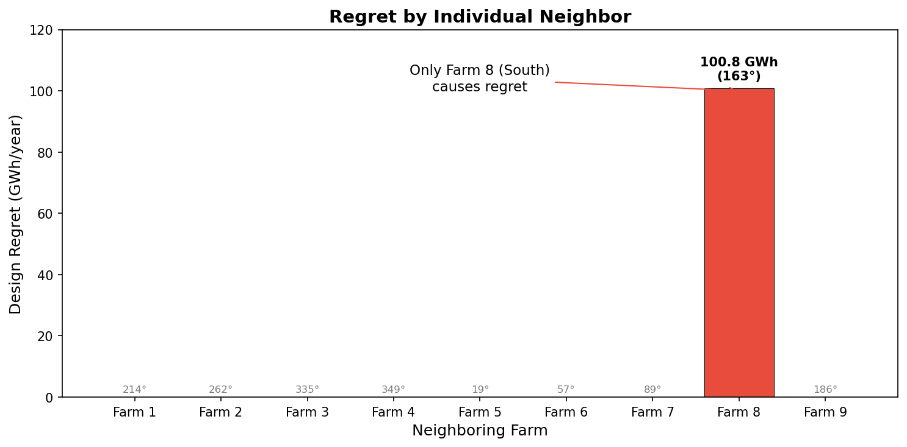
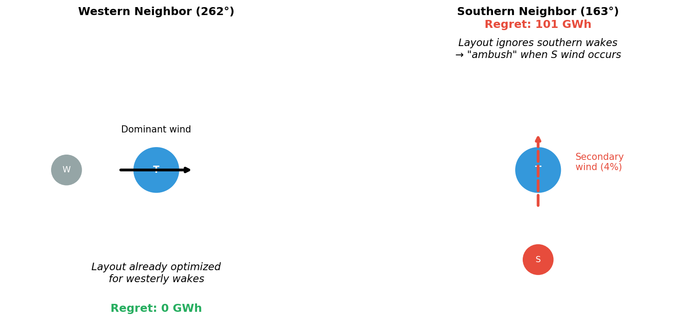

# Danish Energy Island (DEI) Case Study

This page documents our analysis of design regret in the Danish Energy Island wind farm cluster.

## The Cluster

The Danish Energy Island is a planned 9.9 GW offshore wind cluster in the North Sea with 10 wind farms arranged in a ring configuration.


*The DEI cluster: target farm (blue) surrounded by 9 neighbors. Farm 8 (red, south) is the sole source of design regret.*

| Component | Specification |
|-----------|---------------|
| Target farm | dk0w_tender_3, 66 turbines, 990 MW |
| Neighbors | 9 farms, 594 turbines total |
| Turbine rating | 15 MW |
| Rotor diameter | 240 m |
| Wind data | 10 years (2012-2021) |

## Key Finding: Only Farm 8 Causes Regret



Using gradient-based optimization, we tested each neighbor individually:

- **8 of 9 neighbors** cause zero regret
- **Farm 8 (South, 163°)** causes **101 GWh regret** (1.2% of AEP)
- All 9 together: 101 GWh (same as Farm 8 alone)

## The Pareto Tradeoff


For Farm 8, there's a clear tradeoff between optimizing for standalone vs. neighbor scenarios:

| Layout | AEP Alone | AEP with Farm 8 |
|--------|-----------|-----------------|
| Liberal-optimal | 8317 GWh | 8194 GWh (-1.5%) |
| Conservative-optimal | 8308 GWh | 8295 GWh (-0.15%) |

The liberal layout loses 10× more energy when Farm 8 is present.

## Why Southern Neighbor, Not Western?

The dominant wind is from the west (270°), yet the southern neighbor (163°) causes all regret while the western neighbor (262°) causes none.



**The "ambush effect"**: Regret measures *layout divergence*, not raw power loss.

| Factor | Western (262°) | Southern (163°) |
|--------|---------------|-----------------|
| Wind frequency | ~10% | ~4% |
| Layout accounts for it? | Yes | No |
| Conservative adjustment | Small | Large |
| **Regret** | **0 GWh** | **101 GWh** |

The liberal layout is already designed for westerly wakes. A western neighbor requires only minor adjustments. But the southern neighbor catches the liberal layout completely off-guard.

## Wind Rose


The Energy Island wind rose shows:

- **Dominant**: West-Southwest (225-270°)
- **Secondary**: South-Southeast (135-180°)
- **Character**: Diffuse (κ ≈ 0.6)

The 4% of wind from southern directions is enough to create 101 GWh regret when the layout ignores it.

<div style="clear: both;"></div>

## Comparison with Random Sampling

The OMAE 2026 paper used random layout sampling and found "no design tradeoffs" in the DEI case. Our gradient-based optimization tells a different story:

| Method | Finding |
|--------|---------|
| Random sampling | ~0 GWh regret |
| Gradient optimization | **101 GWh regret** |

Random sampling misses the tradeoff because optimal liberal layouts are unlikely to be sampled by chance.

## Summary

| Finding | Value |
|---------|-------|
| Total cluster regret | 101 GWh/year |
| Regret source | Farm 8 only |
| Farm 8 direction | 163° (South) |
| Farm 8 distance | 29.3 km |
| Dominant wind | 270° (West) |
| Key mechanism | Ambush effect |

**Bottom line**: Ring geometry does not eliminate tradeoffs. A single off-axis neighbor can cause significant regret by exploiting layout blind spots.

## Replication

```bash
pixi run python scripts/run_dea_single_neighbor.py --n-starts=5 --max-iter=500
```

Data files:
- `DEA_neighbors/energy_island_10y_daily_av_wind.csv` - Wind time series
- `DEA_neighbors/re_precomputed_layouts.h5` - Farm layouts
- `analysis/dea_single_neighbor/` - Results
