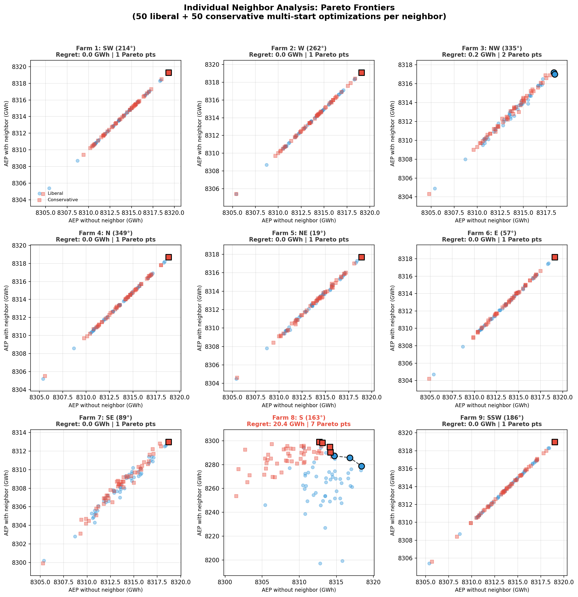
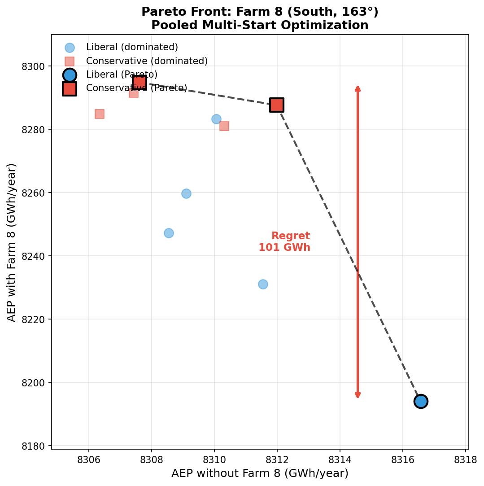
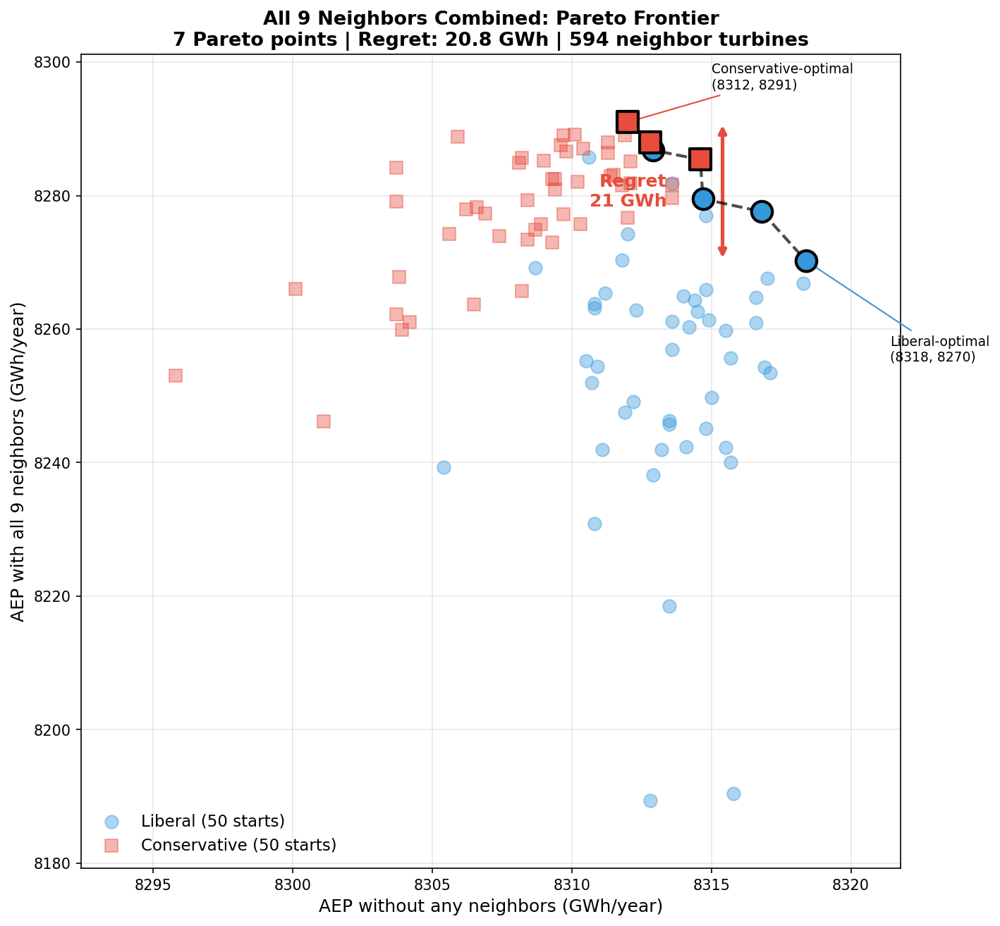

# Danish Energy Island (DEI) Case Study

This page documents our analysis of design regret in the Danish Energy Island wind farm cluster.

## The Cluster

The Danish Energy Island is a planned 9.9 GW offshore wind cluster in the North Sea with 10 wind farms arranged in a ring configuration.


*The DEI cluster: target farm (blue) surrounded by 9 neighbors. Farm 8 (red, south) is the sole source of design regret.*

| Component | Specification |
|-----------|---------------|
| Target farm | dk0w_tender_3, 66 turbines, 990 MW |
| Neighbors | 9 farms, 594 turbines total |
| Turbine rating | 15 MW |
| Rotor diameter | 240 m |
| Wind data | 10 years (2012-2021) |

## Key Finding: Only Farm 8 Causes Regret

Using gradient-based optimization with 50 random starts and 2000 iterations per start, we tested each neighbor individually:

| Farm | Direction | Distance | Regret (GWh) | Regret (%) |
|------|-----------|----------|--------------|------------|
| 1 - dk1d_tender_9 | 214° (SW) | 38.9 km | 0.00 | 0.00% |
| 2 - dk0z_tender_5 | 262° (W) | 21.9 km | 0.00 | 0.00% |
| 3 - dk0v_tender_1 | 335° (NW) | 29.2 km | 0.15 | 0.00% |
| 4 - dk0Y_tender_4 | 349° (N) | 55.2 km | 0.00 | 0.00% |
| 5 - dk0x_tender_2 | 19° (NE) | 37.2 km | 0.00 | 0.00% |
| 6 - dk1a_tender_6 | 57° (E) | 43.7 km | 0.00 | 0.00% |
| 7 - dk1b_tender7 | 89° (SE) | 24.5 km | 0.00 | 0.00% |
| **8 - dk1c_tender_8** | **163° (S)** | **29.3 km** | **20.37** | **0.25%** |
| 9 - dk1e_tender_10 | 186° (SSW) | 57.9 km | 0.00 | 0.00% |
| **All 9 combined** | - | - | **20.79** | **0.25%** |

**Key observations:**
- **8 of 9 neighbors** cause effectively zero regret
- **Farm 8 (South, 163°)** causes **20.4 GWh regret** (0.25% of AEP)
- All 9 together: 20.8 GWh—virtually identical to Farm 8 alone
- Farm 3 (NW) shows negligible regret (0.15 GWh)

## Individual Neighbors Analysis

For each neighbor farm, we ran 50 multi-start optimizations under two strategies:
- **Liberal** (blue circles): Optimize the target layout ignoring the neighbor
- **Conservative** (red squares): Optimize the target layout considering the neighbor

Each layout is then evaluated under both scenarios (with and without the neighbor), producing a scatter plot of AEP with neighbor vs AEP without neighbor. Pareto-optimal points are shown with black outlines.


*Pareto frontiers for each of the 9 neighbors. Each plot shows 100 points from 50 multi-start optimizations (50 liberal + 50 conservative). Only Farm 8 (South) shows a meaningful Pareto frontier with multiple non-dominated solutions.*

**Observations:**
- **Farms 1, 2, 4-7, 9**: All 100 optimization results collapse to a single Pareto point—liberal and conservative strategies find the same optimum. No design tradeoff exists.
- **Farm 3 (NW, 335°)**: Shows 2 Pareto points with negligible spread (0.2 GWh regret).
- **Farm 8 (S, 163°)**: Clear Pareto frontier with 7 non-dominated points spanning 20.4 GWh of regret. This is the only neighbor that creates a meaningful design tradeoff.

### Farm 8 Detail


*Detailed Pareto frontier for Farm 8: The southern neighbor creates a clear tradeoff between layouts optimized for standalone operation (liberal) vs. considering the neighbor (conservative).*

| Layout | AEP Alone | AEP with Farm 8 | Loss |
|--------|-----------|-----------------|------|
| Liberal-optimal | 8318 GWh | 8279 GWh | -0.47% |
| Conservative-optimal | 8313 GWh | 8299 GWh | -0.17% |
| **Regret** | | | **20.4 GWh** |

The Pareto frontier contains **7 non-dominated layouts**, showing a continuous tradeoff. The liberal-optimal layout sacrifices 20 GWh/year when Farm 8 is present compared to the conservative-optimal layout.

## All Neighbors Combined

When all 9 neighbors are present simultaneously (594 neighbor turbines), we test:
- **Liberal**: Optimize ignoring all neighbors, evaluate with and without all neighbors
- **Conservative**: Optimize considering all 9 neighbors, evaluate with and without all neighbors


*Pareto frontier for all 9 neighbors combined. Each point represents a layout from 50 multi-start optimizations under liberal (ignoring neighbors) or conservative (considering all 9 neighbors) strategies.*

| Layout | AEP Alone | AEP with All Neighbors | Loss |
|--------|-----------|------------------------|------|
| Liberal-optimal | 8318 GWh | 8270 GWh | -0.58% |
| Conservative-optimal | 8312 GWh | 8291 GWh | -0.25% |
| **Regret** | | | **20.8 GWh** |

The combined regret (20.8 GWh) is virtually identical to Farm 8 alone (20.4 GWh), confirming that **Farm 8 is the sole driver of design regret** in the DEI cluster. The other 8 neighbors add only 0.4 GWh to the total regret.

## Effect of Optimization Thoroughness

Regret measurement depends critically on optimization quality. With insufficient optimization, liberal layouts may be suboptimal and appear more vulnerable than necessary:

| Configuration | Pareto Points | Regret (GWh) | Notes |
|---------------|---------------|--------------|-------|
| 5 starts, 500 iter | 3 | 101 GWh | Preliminary |
| **50 starts, 2000 iter** | **7** | **20.4 GWh** | Final |

The 5× reduction in measured regret comes from finding better liberal layouts that are naturally less vulnerable to the southern neighbor. This demonstrates that **regret is an upper bound** that tightens with more thorough optimization.

## Why Southern Neighbor, Not Western?

The dominant wind is from the west (270°), yet the southern neighbor (163°) causes all regret while the western neighbor (262°) causes none.

**The "ambush effect"**: Regret measures *layout divergence*, not raw power loss.

| Factor | Western (262°) | Southern (163°) |
|--------|---------------|-----------------|
| Wind frequency | ~10% | ~4% |
| Layout accounts for it? | Yes | No |
| Conservative adjustment | Small | Large |
| **Regret** | **0 GWh** | **20.4 GWh** |

The liberal layout is already designed for westerly wakes. A western neighbor requires only minor adjustments. But the southern neighbor catches the liberal layout off-guard—even 4% of wind from the south is enough to create measurable regret.

## Wind Rose


The Energy Island wind rose shows:

- **Dominant**: West-Southwest (225-270°)
- **Secondary**: South-Southeast (135-180°)
- **Character**: Diffuse (κ ≈ 0.6)

The 4% of wind from southern directions creates 20 GWh regret when the layout ignores it.

<div style="clear: both;"></div>

## Comparison with Random Sampling

The OMAE 2026 paper used random layout sampling and found "no design tradeoffs" in the DEI case. Our gradient-based optimization tells a different story:

| Method | Finding |
|--------|---------|
| Random sampling | ~0 GWh regret |
| Gradient optimization (50 starts) | **20.4 GWh regret** |

Random sampling misses the tradeoff because optimal liberal layouts are unlikely to be sampled by chance.

## Summary

| Finding | Value |
|---------|-------|
| Total cluster regret | 20.8 GWh/year |
| Regret as % of AEP | 0.25% |
| Regret source | Farm 8 only |
| Farm 8 direction | 163° (South) |
| Farm 8 distance | 29.3 km |
| Dominant wind | 278° (West) |
| Pareto-optimal layouts | 7 |
| Key mechanism | Ambush effect |

**Bottom line**: Ring geometry does not eliminate tradeoffs. A single off-axis neighbor can cause significant regret by exploiting layout blind spots. However, thorough optimization finds layouts that are robust to both scenarios, reducing regret from 101 GWh (preliminary) to 20.4 GWh (with rigorous multi-start optimization).

## Replication

Quick run (preliminary):
```bash
pixi run python scripts/run_dea_single_neighbor.py --n-starts=5 --max-iter=500
```

Full analysis (as reported above):
```bash
# Individual farms (can run in parallel, 3 at a time)
for farm in 1 2 3 4 5 6 7 8 9; do
    pixi run python scripts/run_dea_single_neighbor.py \
        --n-starts=50 --max-iter=2000 \
        --farm=$farm --skip-combined \
        -o analysis/dei_50starts_2000iter
done

# All neighbors combined
pixi run python scripts/run_dea_single_neighbor.py \
    --n-starts=50 --max-iter=2000 \
    --only-combined \
    -o analysis/dei_50starts_2000iter_combined
```

Data files:
- `DEA_neighbors/energy_island_10y_daily_av_wind.csv` - Wind time series
- `DEA_neighbors/re_precomputed_layouts.h5` - Farm layouts
- `analysis/dei_50starts_2000iter/` - Individual farm results
- `analysis/dei_50starts_2000iter_combined/` - Combined results
