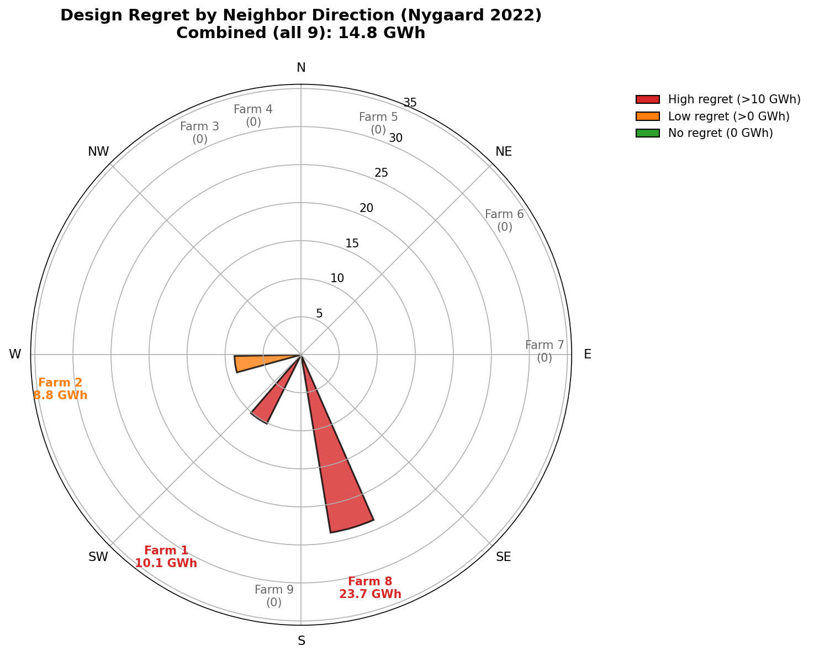

# DEI Case Study: Nygaard 2022 Wake Model

This page documents design regret analysis using PyWake's **Nygaard_2022** literature wake model defaults.

For comparison with other wake models, see the [main DEI case study](dei-case-study.md).

## Wake Model Configuration

The Nygaard_2022 model from PyWake's literature module uses TurboGaussianDeficit with these defaults:

| Parameter | Value | Description |
|-----------|-------|-------------|
| A | 0.04 | Wake expansion coefficient |
| ct2a | ct2a_mom1d | 1D momentum theory |
| ctlim | 0.96 | CT limit |
| superposition | SquaredSum | Wake superposition method |
| use_effective_ws | False | Use ambient wind speed |
| use_effective_ti | False | Use ambient turbulence |
| groundModel | Mirror* | Reflects wakes off ground |
| rotorAvgModel | GaussianOverlapAvgModel* | Rotor-averaged wake |

*Not available in pixwake; analysis uses rotor-center evaluation without ground reflection.

### Key Differences from Other Configurations

| Parameter | Nygaard_2022 | OMAE Setup | Bastankhah |
|-----------|--------------|------------|------------|
| Model | TurboGaussianDeficit | TurboGaussianDeficit | BastankhahGaussianDeficit |
| A / k | 0.04 | 0.02 | 0.04 |
| Superposition | **SquaredSum** | **LinearSum** | SquaredSum |
| Effective WS/TI | No | Yes | N/A |
| Turbulence model | None | CrespoHernandez | None |
| Ambient TI | 0.06 | 0.06 | N/A |

The main differences between Nygaard_2022 and OMAE are:

1. **A parameter**: Nygaard_2022 uses A=0.04 (wider wakes) vs OMAE's A=0.02 (narrower wakes)
2. **Superposition**: Nygaard_2022 uses SquaredSum (root-sum-of-squares) vs OMAE's LinearSum (direct addition)
3. **Effective quantities**: Nygaard_2022 uses ambient WS/TI; OMAE uses effective (wake-modified) values

## Results Summary


*Design regret by neighbor direction. Only 3 of 9 neighbors create non-zero regret.*

| Farm | Direction | Distance | Regret (GWh) | Regret (%) | Pareto Pts |
|------|-----------|----------|--------------|------------|------------|
| 1 - dk1d_tender_9 | 214° (SW) | 38.9 km | 10.12 | 0.18% | 3 |
| 2 - dk0z_tender_5 | 262° (W) | 21.9 km | 8.76 | 0.16% | 2 |
| 3 - dk0v_tender_1 | 335° (NW) | 29.2 km | 0.00 | 0.00% | 1 |
| 4 - dk0Y_tender_4 | 349° (N) | 55.2 km | 0.00 | 0.00% | 1 |
| 5 - dk0x_tender_2 | 19° (NE) | 37.2 km | 0.00 | 0.00% | 1 |
| 6 - dk1a_tender_6 | 57° (E) | 43.7 km | 0.00 | 0.00% | 1 |
| 7 - dk1b_tender7 | 89° (SE) | 24.5 km | 0.00 | 0.00% | 1 |
| **8 - dk1c_tender_8** | **163° (S)** | **29.3 km** | **23.71** | **0.43%** | **4** |
| 9 - dk1e_tender_10 | 186° (SSW) | 57.9 km | 0.00 | 0.00% | 1 |
| **All 9 combined** | (ring) | - | **14.77** | - | 5 |

## Key Findings

### Farm 8 (South) Dominates Regret

Farm 8 at 163° causes **23.71 GWh** of design regret—more than double the next highest (Farm 1 at 10.12 GWh). This is because:

- Dominant wind is from 278° (West)
- Farm 8 is directly downwind at 163° (South)
- Liberal layouts optimized for westerly winds are vulnerable to southern wakes

| Layout | AEP Alone | AEP with Farm 8 | Wake Loss |
|--------|-----------|-----------------|-----------|
| Liberal-optimal | 5575.3 GWh | 5454.1 GWh | 2.17% |
| Conservative-optimal | 5567.7 GWh | 5477.8 GWh | 1.61% |
| **Regret** | 7.6 GWh | **23.7 GWh** | - |

### Three Neighbors Create Regret

Unlike some wake models where only Farm 8 matters, Nygaard_2022 shows regret from three directions:

1. **Farm 8 (S, 163°)**: 23.71 GWh - Primary source
2. **Farm 1 (SW, 214°)**: 10.12 GWh - Secondary source
3. **Farm 2 (W, 262°)**: 8.76 GWh - Tertiary source

The western neighbor (Farm 2) now shows measurable regret, likely because:
- Nygaard_2022 uses A=0.04 (stronger wake expansion than OMAE's A=0.02)
- SquaredSum superposition amplifies wake effects
- The western neighbor at 262° is close (21.9 km) and aligned with dominant wind

### Ring Effect Reduces Total Regret

The combined regret with all 9 neighbors (14.77 GWh) is **less than** Farm 8 alone (23.71 GWh).

This "ring effect" occurs because:
- Layouts optimized for all neighbors naturally spread turbines more evenly
- This moderate spreading also happens to reduce vulnerability to Farm 8
- The symmetric ring geometry provides natural hedging

## Comparison with Other Wake Models

| Metric | Nygaard_2022 | OMAE (LinearSum) | Bastankhah |
|--------|--------------|------------------|------------|
| A parameter | 0.04 | 0.02 | 0.04 (k) |
| Superposition | SquaredSum | LinearSum | SquaredSum |
| Target AEP (alone) | 5575 GWh | 5452 GWh | 5829 GWh |
| Farm 8 regret | 23.71 GWh | 36.28 GWh | 10.2 GWh |
| Farm 8 regret % | 0.43% | 0.69% | 0.18% |
| Total cluster regret | 14.77 GWh | ~14 GWh | ~10 GWh |
| Neighbors with regret | 3 | 1 | 1 |

**Key observations:**
- Nygaard_2022 predicts ~2% higher standalone AEP than OMAE setup
- Farm 8 regret is lower (23.7 vs 36.3 GWh) but still dominant
- Three neighbors show regret vs only one in other models
- Ring geometry reduces total regret in all models

## Replication

Run the full Nygaard_2022 analysis:

```bash
pixi run python scripts/run_dei_single_neighbor.py \
    --wake-model=turbopark \
    --n-starts=50 --max-iter=2000 \
    --output-dir=analysis/dei_nygaard2022
```

The script uses Nygaard_2022 defaults (A=0.04, SquaredSum, ambient WS/TI).

Output files:
- `analysis/dei_nygaard2022/dei_single_neighbor_turbopark.json` - Full results
- `analysis/dei_nygaard2022/dei_single_neighbor_turbopark.png` - Polar plot
- `analysis/dei_nygaard2022/layouts_farm[1-9].h5` - 100 optimized layouts per farm

## Data

Each farm's HDF5 file contains 100 layouts (50 liberal + 50 conservative):

```python
import h5py

with h5py.File('analysis/dei_nygaard2022/layouts_farm8.h5', 'r') as f:
    for i in range(f.attrs['n_layouts']):
        layout = f[f'layout_{i}']
        x, y = layout['x'][:], layout['y'][:]
        aep_absent = layout.attrs['aep_absent']
        aep_present = layout.attrs['aep_present']
        strategy = layout.attrs['strategy']  # 'liberal' or 'conservative'
```
