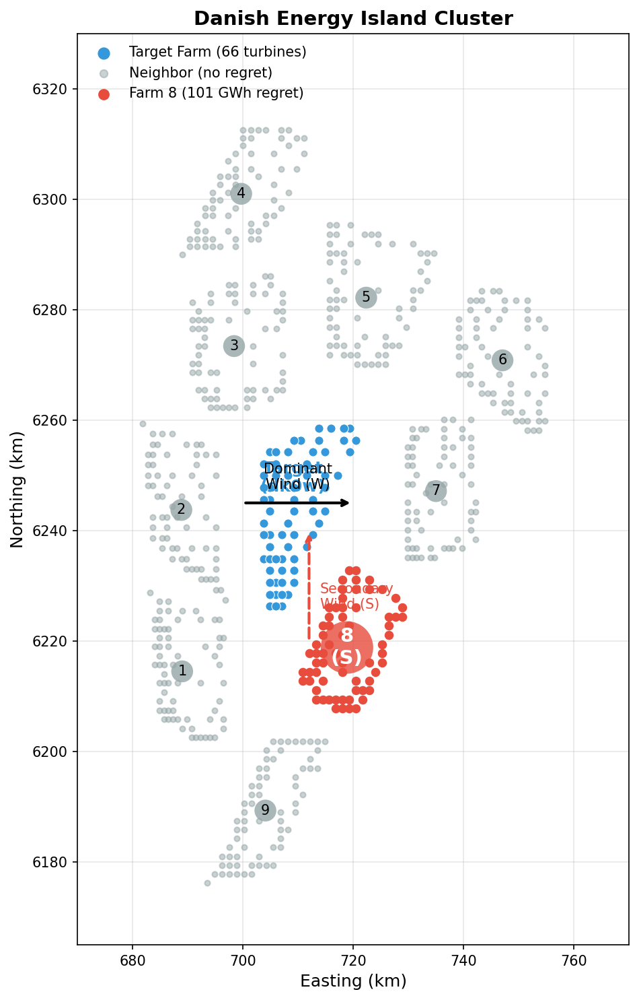
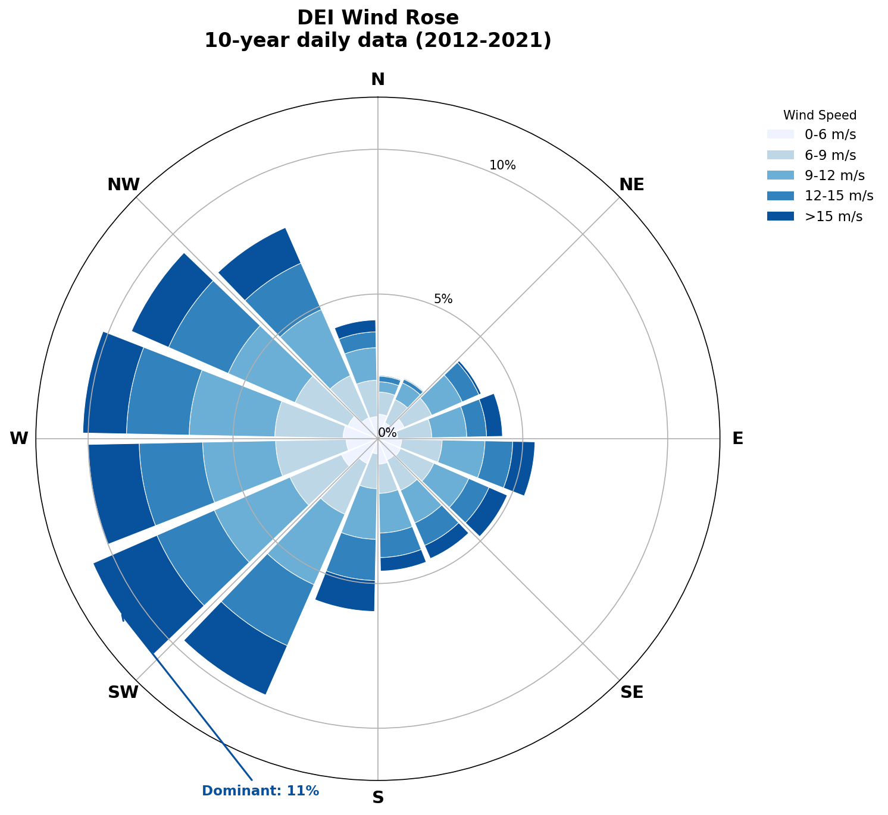

# DEI Case Study: Nygaard 2022 Wake Model

This page documents design regret analysis using PyWake's **Nygaard_2022** literature wake model defaults.

**See also:** [Main DEI case study](dei-case-study.md) for analysis with Bastankhah and OMAE wake models.

## The Cluster

The Danish Energy Island is a planned 9.9 GW offshore wind cluster in the North Sea with 10 wind farms arranged in a ring configuration.


*The DEI cluster: target farm (blue) surrounded by 9 neighbors.*

| Component | Specification |
|-----------|---------------|
| Target farm | dk0w_tender_3, 66 turbines, 990 MW |
| Neighbors | 9 farms, 594 turbines total |
| Turbine rating | 15 MW |
| Rotor diameter | 240 m |
| Wind data | 10 years (2012-2021) |

## Wake Model Configuration

The Nygaard_2022 model from PyWake's literature module:

| Parameter | Value |
|-----------|-------|
| Model | TurboGaussianDeficit |
| A | 0.04 |
| ct2a | ct2a_mom1d |
| ctlim | 0.96 |
| superposition | SquaredSum |
| use_effective_ws | False (ambient) |
| use_effective_ti | False (ambient) |
| Ambient TI | 0.06 |

## Key Finding: Three Neighbors Cause Regret

Using gradient-based optimization with 50 random starts and 2000 iterations per start, we tested each neighbor individually:

| Farm | Direction | Distance | Regret (GWh) | Regret (%) |
|------|-----------|----------|--------------|------------|
| **1 - dk1d_tender_9** | **214° (SW)** | **38.9 km** | **10.12** | **0.18%** |
| **2 - dk0z_tender_5** | **262° (W)** | **21.9 km** | **8.76** | **0.16%** |
| 3 - dk0v_tender_1 | 335° (NW) | 29.2 km | 0.00 | 0.00% |
| 4 - dk0Y_tender_4 | 349° (N) | 55.2 km | 0.00 | 0.00% |
| 5 - dk0x_tender_2 | 19° (NE) | 37.2 km | 0.00 | 0.00% |
| 6 - dk1a_tender_6 | 57° (E) | 43.7 km | 0.00 | 0.00% |
| 7 - dk1b_tender7 | 89° (SE) | 24.5 km | 0.00 | 0.00% |
| **8 - dk1c_tender_8** | **163° (S)** | **29.3 km** | **23.71** | **0.43%** |
| 9 - dk1e_tender_10 | 186° (SSW) | 57.9 km | 0.00 | 0.00% |
| **All 9 combined** | (ring) | - | **14.77** | **0.27%** |

**Key observations:**
- **6 of 9 neighbors** cause zero regret
- **Farm 8 (South, 163°)** causes **23.71 GWh regret** (0.43% of AEP) - highest
- **Farm 1 (SW, 214°)** causes **10.12 GWh regret** (0.18%)
- **Farm 2 (W, 262°)** causes **8.76 GWh regret** (0.16%)
- All 9 together: **14.77 GWh**—less than Farm 8 alone due to ring effect

## Individual Neighbors Analysis

For each neighbor farm, we ran 50 multi-start optimizations under two strategies:
- **Liberal** (blue circles): Optimize the target layout ignoring the neighbor
- **Conservative** (red squares): Optimize the target layout considering the neighbor

Each layout is then evaluated under both scenarios (with and without the neighbor), producing a scatter plot of AEP with neighbor vs AEP without neighbor. Pareto-optimal points are shown with black outlines.

*[Figure: Individual neighbors Pareto plots - TODO: generate dei_individual_neighbors_nygaard2022.png]*

**Observations:**
- **Farms 3-7, 9**: All optimization results collapse to a single Pareto point—no design tradeoff exists.
- **Farm 1 (SW, 214°)**: Shows 3 Pareto points with 10.12 GWh regret.
- **Farm 2 (W, 262°)**: Shows 2 Pareto points with 8.76 GWh regret.
- **Farm 8 (S, 163°)**: Clear Pareto frontier with 4 non-dominated points spanning 23.71 GWh of regret.

### Farm 8 Detail

*[Figure: Farm 8 Pareto - TODO: generate dei_pareto_farm8_nygaard2022.png]*

| Layout | AEP Alone | AEP with Farm 8 | Loss |
|--------|-----------|-----------------|------|
| Liberal-optimal | 5575.3 GWh | 5454.1 GWh | -2.17% |
| Conservative-optimal | 5567.7 GWh | 5477.8 GWh | -1.61% |
| **Regret** | 7.6 GWh | **23.71 GWh** | - |

The Pareto frontier contains **4 non-dominated layouts**, showing a tradeoff between standalone performance and robustness to the southern neighbor.

## All Neighbors Combined

When all 9 neighbors are present simultaneously (594 neighbor turbines):

*[Figure: Combined Pareto - TODO: generate dei_pareto_combined_nygaard2022.png]*

| Layout | AEP Alone | AEP with All Neighbors | Loss |
|--------|-----------|------------------------|------|
| Liberal-optimal | 5575 GWh | 5098 GWh | -8.6% |
| Conservative-optimal | 5556 GWh | 5113 GWh | -8.0% |
| **Regret** | | | **14.77 GWh** |

The combined regret (14.77 GWh) is **less than** Farm 8 alone (23.71 GWh). This "ring effect" occurs because layouts optimized for all neighbors naturally spread turbines more evenly, which also reduces vulnerability to Farm 8.

## Why Three Neighbors, Not Just Farm 8?

Unlike Bastankhah where only Farm 8 causes regret, Nygaard_2022 shows regret from three directions:

| Neighbor | Direction | Regret | Why? |
|----------|-----------|--------|------|
| Farm 8 (S) | 163° | 23.71 GWh | Directly downwind of dominant westerly |
| Farm 1 (SW) | 214° | 10.12 GWh | Partially downwind, close to dominant |
| Farm 2 (W) | 262° | 8.76 GWh | Aligned with dominant wind, closest (21.9 km) |

The wider wake expansion (A=0.04 vs 0.02) and SquaredSum superposition make the western neighbor's wakes more impactful at this distance.

## Wind Rose



The Energy Island wind rose shows:

- **Dominant**: West-Southwest (225-270°)
- **Secondary**: South-Southeast (135-180°)
- **Mean speed**: 10.6 m/s

The 4% of wind from southern directions creates 23.71 GWh regret when the layout ignores it.

<div style="clear: both;"></div>

## Comparison with Other Wake Models

| Metric | Nygaard_2022 | Bastankhah | OMAE TurboPark |
|--------|--------------|------------|----------------|
| A / k parameter | 0.04 | 0.04 | 0.02 |
| Superposition | SquaredSum | SquaredSum | LinearSum |
| Target AEP (alone) | 5575 GWh | 5829 GWh | 5436 GWh |
| Farm 8 regret | **23.71 GWh** | 10.2 GWh | 36.3 GWh |
| Farm 8 regret % | 0.43% | 0.18% | 0.69% |
| Neighbors with regret | **3** | 1 | 1 |
| Combined regret | 14.77 GWh | ~10 GWh | ~14 GWh |

**Key insight**: Nygaard_2022 predicts intermediate regret magnitude but shows regret from more directions due to wider wake expansion.

## Summary

| Finding | Value |
|---------|-------|
| Target farm AEP | 5575 GWh |
| Total cluster regret (Farm 8) | 23.71 GWh/year |
| Combined regret (all 9) | 14.77 GWh/year |
| Regret as % of AEP | 0.43% (Farm 8) |
| Primary regret source | Farm 8 (South, 163°) |
| Secondary sources | Farm 1 (SW), Farm 2 (W) |
| Dominant wind | 236° (WSW) |
| Key mechanism | Ambush effect + wider wakes |

**Bottom line**: With Nygaard_2022 defaults, three neighbors cause measurable regret instead of one. The ring geometry still reduces combined regret below the worst individual case.

## Replication

```bash
pixi run python scripts/run_dei_single_neighbor.py \
    --wake-model=turbopark \
    --n-starts=50 --max-iter=2000 \
    --output-dir=analysis/dei_nygaard2022
```

Output files:
- `analysis/dei_nygaard2022/dei_single_neighbor_turbopark.json` - Full results
- `analysis/dei_nygaard2022/layouts_farm[1-9].h5` - 100 optimized layouts per farm
- `analysis/dei_nygaard2022/layouts_combined.h5` - Combined case layouts
