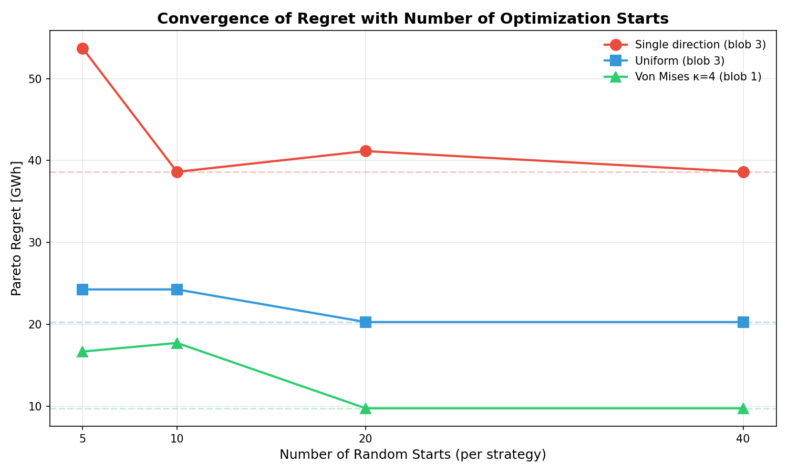

# Methodology

## Problem Setup

### Target Wind Farm

- **Size**: 16 turbines in a 16D × 16D square area
- **Rotor diameter (D)**: 200 m
- **Hub height**: 120 m
- **Rated power**: 10 MW per turbine
- **Minimum spacing**: 4D (800 m)

### Neighboring Farm Representation

Potential neighboring farms are represented as "blobs" - morphable shapes defined by B-spline boundaries with 4 control points. For each analysis run, we **randomly sample** multiple blob configurations to explore how different neighbor geometries affect design tradeoffs.

**Important**: The blob shapes are randomly sampled, not optimized to find worst-case configurations. This Monte Carlo approach provides a distribution of possible regret values across different neighbor geometries, but does not guarantee finding the absolute worst-case scenario.


*Example blob (coral/red region) positioned upwind of the target farm (dashed rectangle). Turbines within the blob create wakes that affect the target farm.*

#### Blob Sampling Parameters

- **Position**: Center sampled within (-10D to -4D, 0.2L to 0.8L) where L = target size
- **Size**: Radius sampled between 5D and 10D
- **Shape**: Aspect ratio sampled between 0.6 and 1.6
- **Number of blobs**: 20 random configurations per wind rose type

### Wake Model

We use the Bastankhah Gaussian deficit model with:

- Turbulence intensity factor: k = 0.04
- Superposition: Linear sum of deficits

The Annual Energy Production (AEP) is computed as:

$$\text{AEP} = \sum_{d} \sum_{i} P_i(U_{i,d}) \cdot w_d \cdot 8760$$

where $P_i$ is the power curve, $U_{i,d}$ is the effective wind speed at turbine $i$ for direction $d$, and $w_d$ is the probability weight.

## Wind Rose Types

### Von Mises Distribution

The Von Mises distribution is the circular analog of the normal distribution:

$$f(\theta; \mu, \kappa) = \frac{e^{\kappa \cos(\theta - \mu)}}{2\pi I_0(\kappa)}$$

where:
- $\mu$ = mean direction (270° = West)
- $\kappa$ = concentration parameter
- $I_0$ = modified Bessel function of order 0

| κ value | Interpretation |
|---------|----------------|
| 0 | Uniform distribution |
| 1 | Mild concentration |
| 2 | Moderate (typical offshore) |
| 4+ | High concentration |

### Wind Rose Configurations Tested

| Type | Description | Parameters |
|------|-------------|------------|
| Single | Unidirectional | 270° only |
| Uniform | Omnidirectional | 24 directions, equal weights |
| Von Mises κ=1 | Diffuse | μ=270°, 24 directions |
| Von Mises κ=2 | Moderate | μ=270°, 24 directions |
| Von Mises κ=4 | Concentrated | μ=270°, 24 directions |
| Bimodal | Two peaks | 270° (70%) + 90° (30%) |

## Optimization Methodology

### What Is Optimized vs. Sampled

| Component | Method | Description |
|-----------|--------|-------------|
| **Blob shape** | Random sampling | B-spline control points sampled from bounded distributions |
| **Neighbor positions** | Fixed grid | 25 potential positions on a 5×5 grid, masked by blob |
| **Target layout** | SGD optimization | Turbine positions optimized via gradient descent |

### Pooled Multi-Start Approach

For each randomly sampled blob configuration, we run a pooled multi-start optimization on the **target farm layout only**:

1. **Liberal Strategy** (20 starts): Optimize target layout assuming neighbors are absent
   - Objective: Maximize AEP_absent
   - Gradient-based optimization with random initialization

2. **Conservative Strategy** (20 starts): Optimize target layout accounting for neighbor wakes
   - Objective: Maximize AEP_present
   - Same optimization procedure

3. **Cross-Evaluation**: All 40 layouts are evaluated under both scenarios

4. **Pareto Analysis**: Identify non-dominated layouts

### SGD Optimization Settings

```python
SGDSettings(
    max_iter=3000,      # For single direction
    # max_iter=2000,    # For 24 directions
    learning_rate=D/5,  # 40 m step size
)
```

### Constraint Handling

- **Boundary constraints**: Soft penalty for turbines outside target area
- **Spacing constraints**: Soft penalty for turbines closer than 4D
- **Gradient projection**: Ensures feasibility during optimization

## Regret Computation

### Pareto Frontier

A layout is **Pareto-optimal** if no other layout achieves both:
- Higher AEP when neighbors are absent, AND
- Higher AEP when neighbors are present

### Regret Definition

$$\text{Regret} = \text{AEP}_{\text{present}}(\text{conservative-opt}) - \text{AEP}_{\text{present}}(\text{liberal-opt})$$

- **Liberal-optimal**: Pareto point with maximum AEP_absent
- **Conservative-optimal**: Pareto point with maximum AEP_present

If regret > 0, there exists a fundamental tradeoff between the two objectives.

## Convergence Verification

To ensure results are not artifacts of insufficient optimization, we verified convergence by varying the number of random starts:

| Configuration | n=5 | n=10 | n=20 | n=40 |
|--------------|-----|------|------|------|
| Single direction | 53.70 | 38.62 | 41.15 | **38.62** |
| Uniform | 24.27 | 24.27 | 20.29 | **20.29** |
| Von Mises κ=4 | 16.69 | 17.75 | 9.77 | **9.77** |



Results stabilize by n=20 starts per strategy. The full analysis uses n=20.
