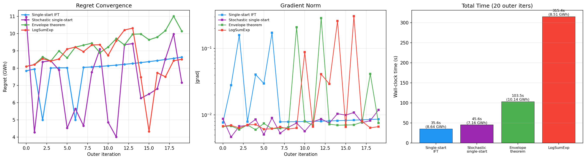

# Multistart Strategies

IFT assumes a unique, smooth mapping `params -> x*(params)`. With multiple random starts, the inner optimization finds different local optima. This page covers the theory behind differentiable multistart approaches and presents measured benchmark results.

Reproduce with:

```bash
pixi run python scripts/benchmark_multistart.py
```

## The Problem

With K random starts, the inner optimization finds K local optima, and the true regret uses the best:

```
true_regret(p) = AEP_liberal - max_k AEP(x*_k(p), p)
```

The `max` operator is non-differentiable at points where the identity of the winning start changes.

## Strategy 1: Single-Start IFT

The baseline. One fixed initial layout, IFT gradient through that single local optimum.

**Pro:** Cheapest per iteration. Gradient is well-defined and smooth.

**Con:** May not find the global optimum. Regret estimate is biased high (conservative layout is suboptimal, so regret looks larger than it truly is).

**Cost per outer step:** `t_forward + t_backward = 1.54 s`

## Strategy 2: Stochastic Single-Start

Randomize `init_x, init_y` each outer iteration. The gradient is a stochastic estimate:

```
grad_t = grad regret(p; start_t)    where start_t ~ Uniform
```

**Theory:** By the law of total expectation, if the inner landscape has M local optima with basins of attraction B_1, ..., B_M, then:

```
E[grad_t] = sum_m P(start in B_m) * grad regret_m(p)
```

This is a probability-weighted average of gradients through each local optimum. ADAM momentum averages over iterations, smoothing the variance. The gradient is **unbiased** in expectation but has high variance when different starts lead to very different gradients.

**Cost per outer step:** `t_forward + t_backward = 1.54 s` (same as single-start, but needs ~2.5x more iterations)

## Strategy 3: Envelope Theorem

The envelope theorem from mathematical economics states that for a parametric optimization problem:

$$V(p) = \max_x f(x, p) \quad \text{s.t.} \quad g(x, p) \leq 0$$

the total derivative of the value function is:

$$\frac{dV}{dp} = \frac{\partial f}{\partial p}\bigg|_{x=x^*(p)}$$

The derivative of the optimum value with respect to parameters equals the partial derivative evaluated at the optimal point, **ignoring how x\* changes with p**. This holds whenever the optimal solution x\*(p) is locally unique and continuously differentiable in p (i.e., away from bifurcation points where the winning start switches).

**Applied to multistarts:** When the winning start k\* is locally stable:

$$\frac{d}{dp} \max_k \text{regret}_k(p) = \frac{d}{dp} \text{regret}_{k^*}(p)$$

So we only need the IFT backward pass through the winning start:

```python
# Forward: run K starts (no grad, just topfarm_sgd_solve)
regrets = [compute_regret_no_grad(p, start_k) for k in range(K)]
best_k = argmax(regrets)
# Backward: IFT through winner only
regret, grad = value_and_grad(compute_regret_start[best_k])(p)
```

**Cost per outer step:** `K * t_forward + 1 * (t_forward + t_backward)`

**Caveat:** The gradient is incorrect at "switching boundaries" where the identity of the best start changes. In practice, ADAM momentum smooths over these discontinuities.

## Strategy 4: LogSumExp Soft Selection

Run K starts, compute regret for each, aggregate with a smooth approximation to max:

$$\text{soft\_max}(p) = \frac{1}{\tau} \log\left(\sum_k \exp(\tau \cdot \text{regret}_k(p))\right)$$

**Theory:** LogSumExp is the Moreau envelope of the max function. As temperature $\tau \to \infty$, it converges to the true max. For finite $\tau$, it provides a differentiable approximation with bounded error:

$$\max_k \text{regret}_k \leq \text{soft\_max} \leq \max_k \text{regret}_k + \frac{\log K}{\tau}$$

The gradient flows through all K starts, weighted by their softmax probabilities:

$$\nabla \text{soft\_max} = \sum_k w_k \cdot \nabla \text{regret}_k \quad \text{where} \quad w_k = \frac{\exp(\tau \cdot \text{regret}_k)}{\sum_j \exp(\tau \cdot \text{regret}_j)}$$

**Cost per outer step:** `K * (t_forward + t_backward)` --- gradients must flow through **all K** backward passes because every start contributes to the softmax weights.

## Why Envelope and LogSumExp Have Different Costs

Both run K forward passes, but they differ in **backward passes**:

- **Envelope:** K forward-only (no grad tracking, just `topfarm_sgd_solve`) + 1 forward+backward through the winner. The other K-1 starts are evaluated without IFT.
- **LogSumExp:** K forward+backward (all K starts need IFT) because the softmax weights $w_k$ depend on every start's regret value. Perturbing neighbor positions changes all K regrets, which changes the weights, which changes the gradient.

Since the backward pass (0.99 s) is 64% of per-start cost (1.54 s), skipping K-1 backward passes is significant:

| K starts | Envelope (K fwd + 1 full) | LogSumExp (K full) | Ratio |
|----------|---------------------------|-------------------|-------|
| 1 | 1.54 s | 1.54 s | 1.0x |
| 5 | 4.29 s | 7.70 s | 1.8x |
| 10 | 7.04 s | 15.40 s | 2.2x |
| 20 | 12.54 s | 30.80 s | 2.5x |

The ratio grows with K because envelope's cost grows as `K * 0.55 + 1.54` while LogSumExp grows as `K * 1.54`.

## Benchmark Results

All four strategies on the same case: 4 targets, 2 neighbors, K=5 starts, 20 outer ADAM iterations, lr=10.



| Strategy | Total time | Per-iter | Final regret | Notes |
|----------|-----------|---------|-------------|-------|
| Single-start IFT | 35.6 s | 1.78 s | 8.64 GWh | Steady climb, no multistart |
| Stochastic single-start | 45.6 s | 2.28 s | 7.16 GWh | High variance, noisy convergence |
| **Envelope theorem (K=5)** | **103.5 s** | **5.18 s** | **10.15 GWh** | **Highest regret found** |
| LogSumExp (K=5, tau=10) | 315.4 s | 15.77 s | 8.51 GWh | 3x slower, destabilized late |

### Envelope wins on both cost and quality

Envelope found 10.15 GWh regret vs LogSumExp's 8.51 GWh, while being 3x cheaper. LogSumExp destabilized around iteration 14 (regret dropped from 10.3 to 4.3 GWh) because the softmax-weighted gradient can point in a compromise direction that doesn't serve any individual start well. Envelope's gradient always points in the direction that improves the *current best* start, which is more targeted.

### Start switching in the envelope approach

The winning start changed 14 times over 20 iterations, cycling among starts 0, 2, 3, and 4:

```
Winning starts: [4, 4, 3, 4, 3, 4, 3, 3, 3, 0, 4, 3, 0, 3, 3, 4, 4, 2, 0, 4]
```

This means the gradient is technically incorrect at each switch. Despite this, ADAM momentum smoothed the trajectory and regret climbed steadily.

### Stochastic single-start: high variance

Regret oscillated between 4.0 and 11.0 GWh due to different random starts landing in different local optima. ADAM momentum cannot fully smooth this because the gradient direction changes drastically when a different local minimum is found.

## Projected Costs for 50 Outer Iterations


| Strategy | K=1 | K=5 | K=10 | K=20 |
|----------|-----|-----|------|------|
| Single-start IFT | 1.3 min | - | - | - |
| Stochastic single-start (~2.5x iters) | 3.2 min | - | - | - |
| Envelope theorem (K fwd + 1 bwd) | 1.3 min | 3.1 min | 5.4 min | 9.9 min |
| LogSumExp (K x full cost) | 1.3 min | 6.4 min | 12.8 min | 25.6 min |
| CMA-ES (100 gens x 10 pop x K starts) | 9.1 min | 45.5 min | 91.1 min | 182.1 min |

## Recommendation

The **envelope theorem** offers the best cost/robustness tradeoff. At K=5, it costs 3.1 min for 50 outer iterations --- only 2.4x more than single-start --- while providing multistart robustness and finding the highest regret in the benchmark.

The frequent start switching (14 switches in 20 iterations) did not degrade performance, suggesting ADAM momentum is sufficient to handle the non-differentiable switching boundaries for this problem.
