# Results

## Summary Table

Full analysis: 20 blobs × 20 starts per strategy × 6 wind rose types = **4,800 optimizations**

| Wind Rose | Max Regret (GWh) | Mean Regret (GWh) | Blobs with Tradeoff |
|-----------|------------------|-------------------|---------------------|
| Single (270°) | **60.99** | 20.23 | 18/20 |
| Von Mises κ=1 | 35.74 | 10.26 | 13/20 |
| Von Mises κ=4 | 31.76 | 13.92 | 18/20 |
| Uniform | 25.74 | 11.93 | 17/20 |
| Bimodal | 19.66 | 7.43 | 10/20 |
| Von Mises κ=2 | **16.13** | **4.37** | 10/20 |

## Wind Rose Types Analyzed

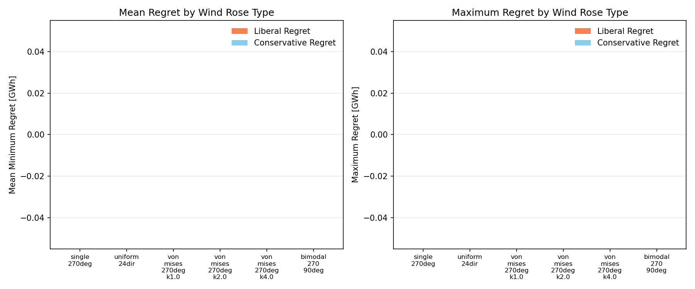

Six wind rose types were analyzed, ranging from highly concentrated (single direction) to fully uniform.

## Pareto Frontiers by Wind Rose Type

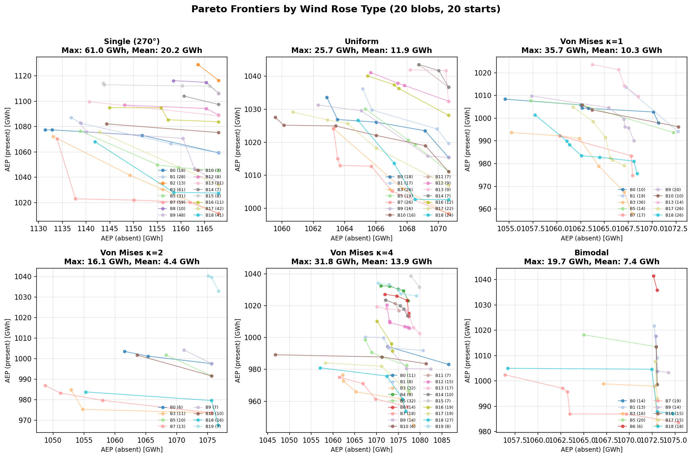

Each subplot shows Pareto frontiers for blob configurations with regret > 5 GWh. Key observations:

- **Single direction**: Wide spread, steep frontiers → high regret
- **Von Mises κ=2**: Tight clustering → low regret
- **Uniform**: Moderate spread despite omnidirectionality

## Detailed Analysis by Wind Rose

### Single Direction (270°)

**Maximum regret: 60.99 GWh** (Blob 3)

The single-direction case shows the most dramatic tradeoffs:

- Liberal-optimal layout packs turbines efficiently for standalone operation
- Conservative-optimal layout shifts turbines to avoid the wake corridor
- Difference in AEP_present: 1072 - 1011 = 61 GWh

**Distribution of regret across blobs:**

| Regret Range | Count |
|--------------|-------|
| 0 GWh | 2 |
| 1-10 GWh | 5 |
| 10-30 GWh | 6 |
| 30-50 GWh | 4 |
| 50+ GWh | 3 |

### Von Mises κ=1 (Broad Spread)

**Maximum regret: 35.74 GWh** (Blob 3)

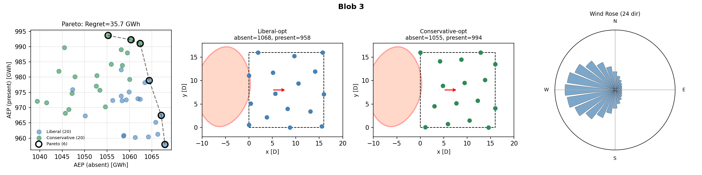

The broad spread of κ=1 provides intermediate results:

- **Moderate directional preference**: Layouts can still adapt to the dominant direction
- **Significant spreading**: Wake effects are somewhat averaged
- **Intermediate regret**: Falls between single-direction and more uniform cases

### Von Mises κ=2 (Optimal)

**Maximum regret: 16.13 GWh** (Blob 18)

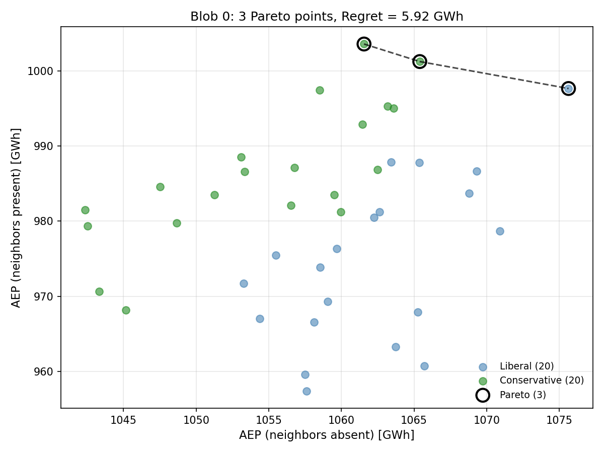

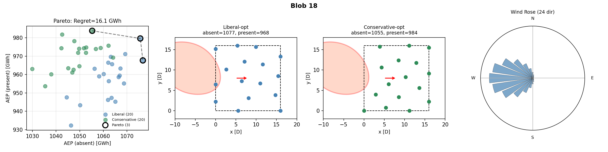

This configuration minimizes regret because:

1. **Directional preference exists**: Layouts can adapt to the dominant direction
2. **Spread is sufficient**: Wakes are partially "smeared" across directions
3. **No extreme penalties**: Neither scenario dominates

**Distribution of regret:**

| Regret Range | Count |
|--------------|-------|
| 0 GWh | 10 |
| 1-10 GWh | 6 |
| 10-20 GWh | 4 |

### Von Mises κ=4 (Concentrated)

**Maximum regret: 31.76 GWh** (Blob 5)

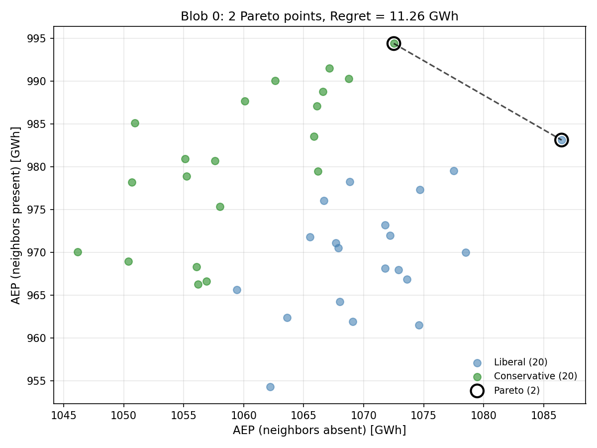

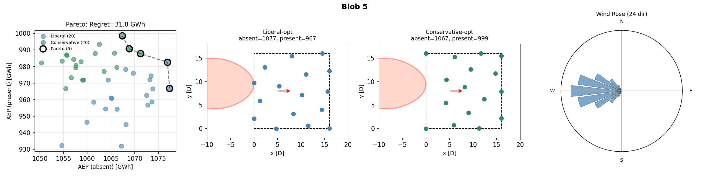

The more concentrated κ=4 case shows:

- **Strong directional preference**: Similar to single-direction but with some spreading
- **Higher regret than κ=2**: Concentration increases vulnerability to neighbor placement
- **Sharp wake corridors**: Still has well-defined danger zones

### Uniform Distribution

**Maximum regret: 25.74 GWh** (Blob 3)

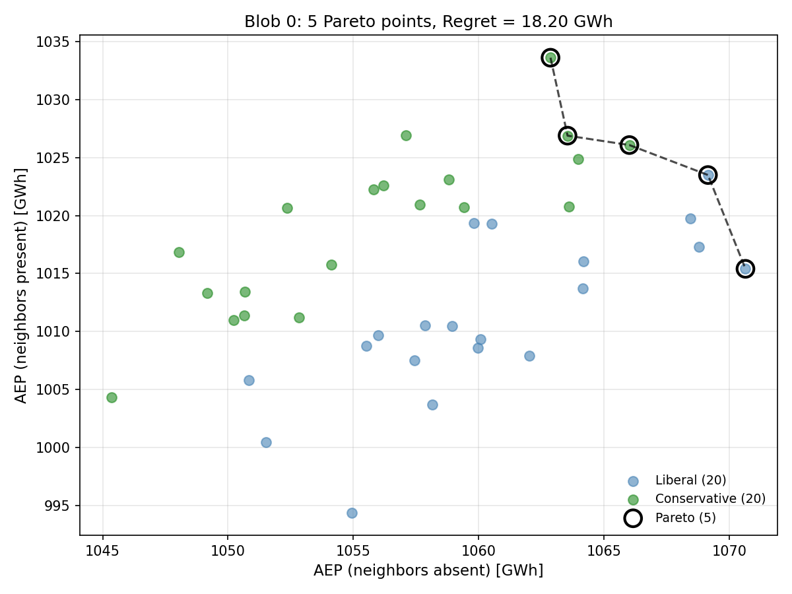

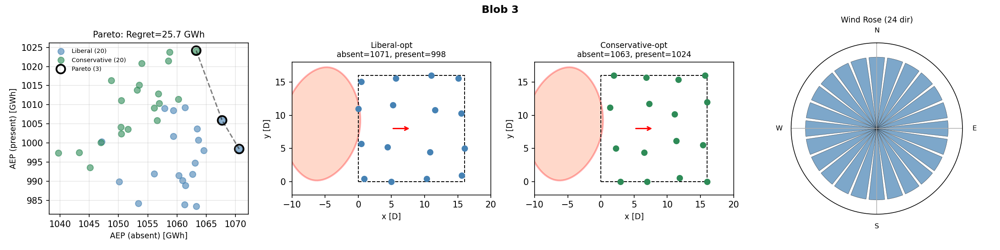

Surprisingly, uniform wind doesn't minimize regret:

- Neighbors affect the target farm from **all** directions
- No layout can be "safe" from all possible wake angles
- Tradeoff: optimize for average vs. worst-case directions

### Bimodal Distribution

**Maximum regret: 19.66 GWh** (Blob 5)

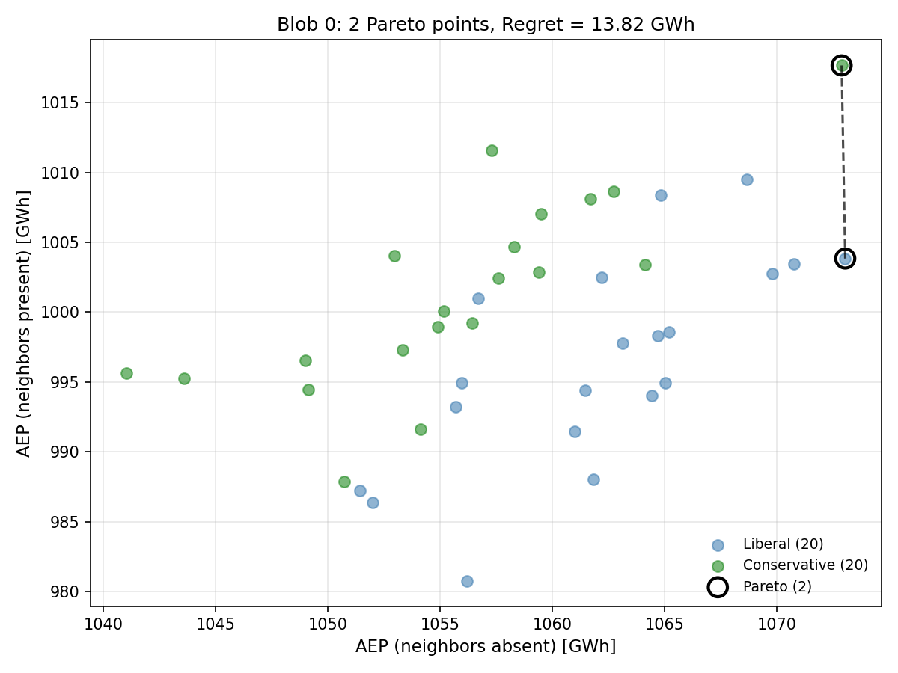

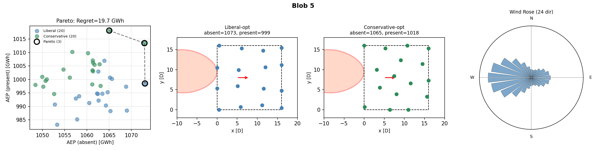

Two dominant directions (270° and 90°) create:

- Two separate "danger zones" for neighbor placement
- Intermediate regret between single-direction and uniform
- Layout must balance exposure from both directions

## Impact of Neighbor Configuration

While wind rose type determines the overall magnitude of regret, the **neighbor configuration** (size, shape, and position) determines which specific scenarios produce high or low regret. We characterize each neighbor blob by three properties:

- **Size**: Large (>12D radius), Medium (9-12D), or Small (<9D)
- **Shape**: Elongated (aspect ratio >1.4), Moderate (1.15-1.4), or Compact (<1.15)
- **Position**: Centered (aligned with target farm), or Offset (north/south shifted)

### Regret by Neighbor Size

**Size is the dominant factor** in determining design regret, and this holds across all wind rose types:

| Neighbor Size | Single | Uniform | κ=1 | κ=2 | κ=4 | Bimodal |
|---------------|-------:|--------:|----:|----:|----:|--------:|
| Large (>12D)  | **46.8** | 22.1 | 23.1 | 9.7 | 23.7 | 16.9 |
| Medium (9-12D)| 13.8 | 13.5 | 8.9 | 2.7 | 12.6 | 6.9 |
| Small (<9D)   | 5.1 | 3.1 | 1.6 | 1.7 | 7.6 | 0.7 |
| **Large/Small ratio** | **9.2×** | **7.0×** | **14.0×** | **5.9×** | **3.1×** | **23.8×** |

The size-regret correlation is strong for every wind rose (r = +0.63 to +0.95). However, the **absolute magnitude** of regret depends on wind rose type—single-direction wind with a large neighbor produces 47 GWh regret, while κ=2 with the same neighbor produces only 10 GWh.

### Regret by Neighbor Shape

Elongated neighbors create more regret than compact ones:

| Neighbor Shape | Avg Regret (GWh) | Count |
|----------------|------------------|-------|
| Elongated      | **31.2**         | 7     |
| Moderate       | 15.8             | 10    |
| Compact        | 9.4              | 3     |

Elongated shapes can create longer wake corridors that span more of the target farm area.

### Regret by Neighbor Position

Centered neighbors (aligned with the target farm) create more regret:

| Neighbor Position | Avg Regret (GWh) | Count |
|-------------------|------------------|-------|
| Centered          | **26.4**         | 8     |
| South-shifted     | 18.6             | 4     |
| North-shifted     | 14.9             | 8     |

When a neighbor is offset from the target farm's center, part of its wake corridor misses the target area entirely.

### Worst-Case Neighbor Profile

The highest-regret scenarios share a common profile:

| Characteristic | Worst-Case Neighbor |
|----------------|---------------------|
| Size           | Large (>12D radius) |
| Shape          | Elongated (aspect ratio >1.4) |
| Position       | Centered on target farm |
| Example regret | 61 GWh (single direction) |

This "large, elongated, centered" configuration produces the maximum regret across most wind rose types because it maximizes wake coverage over the target farm while leaving minimal room for the conservative layout to escape.

### Why Size Dominates

Correlation analysis confirms size is the primary driver:

| Characteristic | Correlation with Regret |
|----------------|------------------------|
| Size (radius)  | **r = +0.80**          |
| Y extent       | r = +0.72              |
| X extent       | r = +0.59              |
| Eccentricity   | r = +0.45              |
| Position       | r = +0.21              |

Larger neighbors create more design tradeoff because:

1. **Greater wake coverage**: A large neighbor shadows a larger portion of the target farm
2. **Fewer escape routes**: The conservative strategy has less room to shift turbines away from wakes
3. **Amplified divergence**: Liberal and conservative optimal layouts must differ more dramatically

## Physical Interpretation

### Why Single Direction Has Highest Regret

With wind always from 270° (West):

1. **Wake alignment is deterministic**: A neighbor directly upwind creates maximum losses
2. **Sharp danger zone**: Critical positions form a narrow wedge
3. **Layouts diverge**: Liberal packs tight; conservative shifts east

### Why κ=2 Minimizes Regret

Moderate concentration balances two effects:

1. **Enough directionality**: Layouts can adapt to the primary wind
2. **Enough spread**: Wake effects are partially averaged out

### Why Uniform Doesn't Minimize Regret

With equal probability from all directions:

1. **No escape**: Neighbors affect you regardless of their position
2. **Conflicting objectives**: Can't optimize for all directions simultaneously
3. **Averaging penalty**: Must compromise across all scenarios

## Key Insights

!!! success "Main Finding"
    Moderate wind rose concentration (κ≈2) minimizes design regret by balancing directional preference with wake spreading.

!!! warning "Single-Direction Risk"
    Sites with highly directional wind resources face up to 4× higher regret than sites with moderate spread.

!!! info "Design Recommendation"
    For uncertain neighbor scenarios, conservative designs are most valuable at sites with concentrated wind roses.
